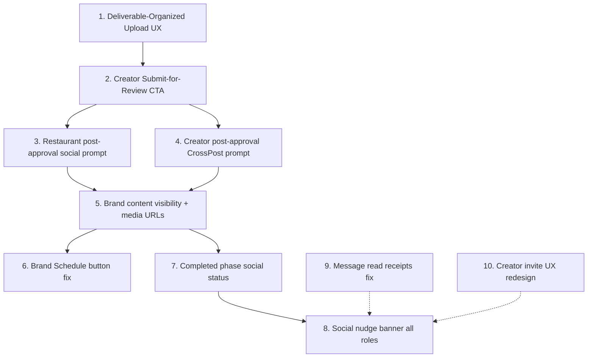

# Content Delivery & Social Posting System Overhaul

## Context

DragonCandy's content delivery system connects three roles — Restaurant, Creator, Brand — through a campaign lifecycle that ends with content approval, payment release, and social posting. The current implementation has working primitives (file upload, approval, escrow, auto-draft posting) but several broken or missing connections between roles, plus UX friction that makes the system feel fragmented rather than flowing. The social posting path is particularly disconnected: after content approval, each party has to navigate away to a separate "Social Media Manager" page (`/outstand`) to find their drafts, with no inline prompt or one-tap path. The Brand role is especially thin — they can't see delivered content, can't review it, and their "Schedule" button shows a toast saying "coming soon."

This plan fixes the broken flows, adds the missing connections, and applies UX patterns from marketplaces that users rave about (Fiverr's order tracking, Airbnb's trip timeline, Poshmark's one-tap listing-to-post) to make the system feel effortless.

## Broken Flows Identified

### Restaurant
1. **No social posting prompt after content approval.** The `ContentReviewSection` fires `fire-campaign-social-hook` in the background, but the UI just shows a static green banner. No CTA to review/schedule the auto-drafted post.
2. **No "Download & Post" path.** Content can only be downloaded file-by-file through the deliverables archive. No bulk download or "share to social" inline.
3. **Completed phase shows no social posting status.** Restaurant can't see if their auto-drafted posts were scheduled, posted, or skipped.

### Creator
1. **No cross-post prompt after content is approved.** The `CrossPostPrompt` component exists but is never mounted in `ActivePhaseView` or `CompletedPhaseView`. Creator has to navigate to `/social` manually.
2. **CompletedPhaseView is minimal.** Just a payment breakdown and delivered items list. No link to post the content, no campaign recap, no social amplification.
3. **ActivePhaseView has no "Submit for Review" button.** Upload and submit are separate concepts, but the creator can upload files without ever submitting them. The `ProjectFileUpload` dialog doesn't trigger content_status change.

### Brand
1. **Cannot see delivered content at all.** `BrandCampaignDetails` has no `ContentReviewSection` or file gallery. The brand is paying for sponsorship but blind to what was delivered.
2. **"Schedule" button in `SponsorshipAmplificationPrompt` shows a toast saying "coming soon."** Dead end.
3. **`mediaUrls` passed to `SponsorshipAmplificationPrompt` is always `[]`.** Even if content is approved, the brand sees no media to amplify.
4. **No Triple Post coordination visibility.** The `TriplePostOrchestrator` component exists but isn't mounted on the brand's campaign detail page.

## Design Approach — Marketplace Patterns

Inspired by:
- **Fiverr's order page**: single timeline view showing every milestone (ordered → in progress → delivered → completed). Both parties see the same timeline, contextual actions appear inline at the right step.
- **Airbnb's trip detail**: one unified card per booking showing status, dates, host actions, and next steps — no hunting through tabs.
- **Poshmark's "Share to Social"**: after listing, one-tap cross-post to connected platforms. Content + caption pre-populated.

**North Star from PROJECT_CONTEXT**: "Less typing = more margin. Every primary flow under 10 keystrokes." Surface order: voice → camera → paste-URL → tap-a-chip → typing last.

## Implementation Plan



### Step 1: Deliverable-Organized Upload UX

**Problem**: The campaign brief requests specific deliverables (e.g., "2 TikTok reels, 1 Instagram story, 3 photos") via `campaign_deliverables`, and `DeliverableCard` renders them in `ActivePhaseView`. But the upload flow (`ProjectFileUpload`) is a generic bulk dropzone — the creator dumps all files into one bucket with no mapping to which deliverable each file fulfills. The `DeliverableCard` tries to match files by checking if `original_filename` contains the deliverable ID or if `metadata.deliverable_id` matches, but nothing in the upload flow sets `metadata.deliverable_id`.

**Files**:
- `src/components/projects/ProjectFileUpload.tsx` — the upload dialog
- `src/components/projects/upload/FileUploadDropzone.tsx` — the dropzone
- `src/hooks/useProjectFileUpload.ts` — upload logic (line 86: metadata doesn't include deliverable_id)
- `src/components/projects/DeliverableCard.tsx` — per-deliverable card with upload button
- `src/components/my-campaigns/ActivePhaseView.tsx` — renders the deliverables list

**Changes**:
- **Per-deliverable upload slots**: Replace the single bulk upload dialog with per-deliverable upload slots. Each `DeliverableCard`'s "Upload" button should open a focused upload for *that specific deliverable*, with `deliverable_id` written to `file_uploads.metadata`.
  - Modify `ProjectFileUpload` to accept an optional `deliverableId` prop and a `deliverableLabel` (e.g., "TikTok Reel #1"). When present, the dialog title becomes "Upload: TikTok Reel #1" and the metadata includes `{ deliverable_id: deliverableId }`.
  - In `useProjectFileUpload`, add `deliverableId` to the metadata object written to the `file_uploads` record.
  - In `DeliverableCard`, wire the `onUpload` prop to open the per-deliverable upload dialog.
- **Progress indicator**: Show "3 of 5 deliverables uploaded" counter above the deliverables list. Use the existing `deliverablesStatus` map to count how many have files.
- **Bulk upload fallback**: Keep the existing "Upload Work" button at the bottom as a "Upload additional files" option for assets that don't map to a specific deliverable (reference photos, raw footage, etc.).
- **Accepted file types per deliverable**: Use `deliverable.content_type` to set the dropzone's `accept` filter — video deliverables only accept `video/*`, photo deliverables only accept `image/*`.

**Marketplace pattern**: Fiverr's delivery page shows each ordered item as a slot with its own upload button and progress — the seller always knows exactly what's left to deliver.

### Step 2: Add "Submit for Review" CTA to Creator's ActivePhaseView

**Problem**: Creator uploads files but never changes `content_status` to `submitted`. Upload and submission are decoupled.

**Files**:
- `src/components/my-campaigns/ActivePhaseView.tsx`
- `src/hooks/useCollaboration.ts` (check for existing submit mutation)

**Changes**:
- Add a prominent "Submit for Review" button that appears once files are uploaded and `content_status` is `in_progress` or `pending`.
- Button calls `supabase.from('campaign_collaborations').update({ content_status: 'submitted' })` and invalidates queries.
- Style: full-width teal pill button (`bg-dc-teal-btn text-white rounded-full font-bold`), placed below the deliverables list.
- Disable if no files uploaded. Show a helper: "Upload your deliverables above, then submit for review."
- Show the deliverable progress counter from Step 1 ("3 of 5 uploaded") — warn if not all deliverables are filled but still allow submission.

### Step 3: Restaurant — Inline Social Prompt After Content Approval

**Problem**: After approving content, the restaurant sees a static green banner with text "Head to your Outstand drafts" — no button, no one-tap path.

**Files**:
- `src/components/campaigns/detail/ContentReviewSection.tsx` (lines 296-306)

**Changes**:
- Replace the static `<p>` tag with an actionable card containing:
  - "View Draft Post" button → navigates to `/dashboard/business/social?tab=drafts`
  - "Schedule Now" button → navigates to `/dashboard/business/social?tab=drafts` (drafts tab has the schedule action)
- Add a `useQuery` that checks `donny_scheduled_posts` for drafts matching this `campaign_id` and current user, showing count: "Donny prepared 2 draft posts"
- Style: teal-50 background card with two pill buttons (primary: "Review & Schedule", outline: "Skip for Now")

### Step 4: Creator — Mount CrossPostPrompt After Approval

**Problem**: `CrossPostPrompt` component exists and works, but is never shown to the creator after content approval.

**Files**:
- `src/components/my-campaigns/ActivePhaseView.tsx`
- `src/components/my-campaigns/CompletedPhaseView.tsx`

**Changes**:
- In `ActivePhaseView`: when `collaboration.content_status === 'approved'`, show the `CrossPostPrompt` inline (auto-open on first view using a `useState` initialized to `true` when status is `approved`).
- Pass `mediaUrls` from `useFileUploads` (the creator's own uploaded files), `campaignTitle` from campaign, and `originalCaption` from the AI-generated caption in `donny_scheduled_posts`.
- In `CompletedPhaseView`: add a "Share to Your Socials" button that opens `CrossPostPrompt`.
- Wrap both in `DragonCandyOutstandProvider` since `CrossPostPrompt` uses Outstand hooks.

### Step 5: Brand — Content Visibility + Media URLs

**Problem**: Brand sponsors a campaign but can't see the delivered content. `BrandCampaignDetails` has zero content review UI. `SponsorshipAmplificationPrompt` receives `mediaUrls={[]}`.

**Files**:
- `src/pages/BrandCampaignDetails.tsx`

**Changes**:
- Add a "Content Delivery" section between the CreatorApplicationsCard and SponsorshipStatusCard.
- Query `file_uploads` for the campaign's deliverables (read-only gallery, brand cannot approve/reject).
- Show the same file gallery grid used in `ContentReviewSection` (extract the grid into a reusable `ContentGallery` component or inline it).
- Show content status badge: "In Progress", "Submitted for Review", "Approved".
- Pass the actual `mediaUrls` (from `file_uploads` signed URLs) to `SponsorshipAmplificationPrompt` instead of `[]`.
- Also pass `creatorName` from the accepted application's creator profile instead of `null`.

**New shared component** (optional, keeps DRY):
- `src/components/campaigns/ContentGallery.tsx` — extracts the image/video grid from `ContentReviewSection` lines 228-284 into a reusable component accepting `files` array. Used by both `ContentReviewSection` and `BrandCampaignDetails`.

### Step 6: Brand — Fix "Schedule" Button Dead End

**Problem**: `SponsorshipAmplificationPrompt` line 177 has `onClick={() => toast.info('Scheduling coming soon')}`.

**Files**:
- `src/components/outstand/SponsorshipAmplificationPrompt.tsx` (line 177)

**Changes**:
- Replace the toast with navigation to the social media manager compose tab with pre-filled data:
  ```
  navigate(`/dashboard/brand/social?tab=compose`)
  ```
- Close the modal and let the user schedule from the compose form (which already works).
- Better yet: replicate what `CrossPostPrompt` does — call the Outstand `createPost` API with `scheduledAt` set. Add a simple datetime picker inline (reuse the pattern from `CustomComposeForm` lines 291-323).

### Step 7: Completed Phase — Social Posting Status for All Roles

**Problem**: After a campaign completes, none of the three roles can see whether their social posts were actually published.

**Files**:
- `src/components/my-campaigns/CompletedPhaseView.tsx` (Creator)
- `src/components/campaigns/detail/ContentReviewSection.tsx` (Restaurant, approved state)
- `src/pages/BrandCampaignDetails.tsx` (Brand, completed sponsorship)

**Changes**:
- Create a `SocialPostStatus` component that queries `donny_scheduled_posts` for the current user + campaign_id and shows:
  - Draft count, scheduled count, published count
  - Link to social manager drafts tab if drafts remain
  - "All posted!" success state with platform icons
- Mount this component in all three completed views.
- Style: compact card with platform badges (Instagram icon, TikTok icon, etc.) and status dots (green = posted, yellow = scheduled, gray = draft).

### Step 8: Unified "Share Your Content" Nudge Banner

**Problem**: After content approval, the system creates `donny_nudges` rows but these aren't surfaced in the campaign detail pages — only in the social manager.

**Files**:
- New: `src/components/campaigns/SocialNudgeBanner.tsx`

**Changes**:
- Create a banner component that checks `donny_nudges` for the current user with `source_table = 'campaign_social_hooks'` and matching campaign_id.
- Shows inline on the campaign detail page (all three roles) with:
  - "Your content is ready to share!" message
  - "Post Now" (primary) and "Review Draft" (outline) buttons
  - Dismissible (marks nudge as `dismissed` in the DB)
- Mount in `CampaignDetailsPage` (restaurant view, active_delivery/completed phase), `ActivePhaseView`/`CompletedPhaseView` (creator), and `BrandCampaignDetails` (when sponsorship accepted + content approved).

### Step 9: Fix Message Notification Badges Not Clearing on Read

**Problem**: When a user opens a conversation with 3 unread messages, the unread badge in the bottom nav and conversation list doesn't disappear. The `useMarkMessagesAsRead` mutation fires correctly (sets `read_at` on messages, invalidates `['conversations']`), but there are two bugs:

1. **`markedRef` prevents re-marking**: In `ConversationMessageThread.tsx` (line 23-30), `markedRef.current` is set to the `conversationId` after the first mark-as-read call. If new messages arrive while the conversation is open, they never get marked as read because the `markedRef` check prevents re-calling. The effect's dependency on `messages.length` should trigger a re-run, but the ref blocks it.

2. **`unread-counts` query never invalidated**: `useMarkMessagesAsRead` (line 216) only invalidates `['conversations']`, but `useUnreadMessageCounts` has query key `['unread-counts']` which is never invalidated. The `useTotalUnreadCount` derives from `useConversations` which IS invalidated, but has a 2-minute `staleTime`, so the badge can remain stale for up to 2 minutes.

**Files**:
- `src/components/messages/ConversationMessageThread.tsx`
- `src/components/messages/MessageThread.tsx` (same pattern, campaign-based messages)
- `src/hooks/useMessageMutations.ts` (line 216)

**Changes**:
- **Fix markedRef logic**: Track the last marked message count or timestamp, not just the conversationId. When `messages.length` changes (new messages arrived), re-mark. Replace `markedRef` with tracking `lastMarkedCount`:
  ```ts
  const lastMarkedRef = useRef<{ id: string; count: number } | null>(null);
  useEffect(() => {
    if (conversationId && user && !isLoading && messages.length > 0) {
      const current = { id: conversationId, count: messages.length };
      if (lastMarkedRef.current?.id !== current.id || lastMarkedRef.current?.count !== current.count) {
        lastMarkedRef.current = current;
        markAsRead.mutate({ conversationId });
      }
    }
  }, [conversationId, user, isLoading, messages.length]);
  ```
- **Invalidate `unread-counts` on mark-as-read**: In `useMarkMessagesAsRead` `onSuccess`, also invalidate `['unread-counts']`:
  ```ts
  onSuccess: () => {
    queryClient.invalidateQueries({ queryKey: ['conversations'] });
    queryClient.invalidateQueries({ queryKey: ['unread-counts'] });
  },
  ```
- **Reduce staleTime for conversations**: Change `staleTime: 120_000` to `staleTime: 30_000` in `useConversations` so the badge updates faster after invalidation.
- Apply the same `markedRef` fix to `MessageThread.tsx` (campaign-based messages, same pattern at line 35).

### Step 10: Creator Invite UX Redesign

**Problem**: The current `InviteToCampaignModal` is functional but minimal — a plain select dropdown for campaign selection and a textarea. Issues:
1. No campaign preview — the dropdown shows just title + spots count, so the restaurant can't confirm they're picking the right campaign.
2. No visibility into who's already been invited to this campaign (the invite could be a duplicate, user doesn't know until the toast says "Already invited").
3. No AI suggestion for the personal note — the textarea is blank, and most users skip it.
4. The invite button is only accessible from the `Browse Creators` page via `CreatorMatchCard` and `CreatorMatchingSection` — not from the creator's public profile or search results.
5. On the creator's side, the `InvitationBanner` is a tiny amber bar with no call-to-action beyond the general "Apply" button.

**Files**:
- `src/components/campaigns/InviteToCampaignModal.tsx`
- `src/components/campaign-details/InvitationBanner.tsx`
- `src/components/campaigns/CreatorMatchingSection.tsx`

**Changes**:

**A. Redesign InviteToCampaignModal**:
- Replace the generic `<Select>` dropdown with a visual campaign card list. Each card shows: campaign cover image (or emoji), title, budget, deadline, deliverable count, and how many spots are filled vs. open.
- Query published campaigns with their invitation count so the restaurant can see at-a-glance availability.
- Add a "Donny suggests" section at the top: auto-select the best-matching campaign based on the creator's skills/platforms (reuse `useCampaignMatches` logic or a simpler heuristic).
- Pre-populate the personal note with a Donny-generated message: "Hey {creatorName}, I think you'd be a great fit for {campaignTitle} because..." — call the `donny-chat` edge function with a one-shot prompt. User can edit or clear.
- Show "Already invited" badge on campaigns where this creator already has an invitation, disabling re-selection.
- Style: bottom sheet on mobile (`Sheet`), dialog on desktop. Campaign cards in a scrollable list with teal highlight on selected.

**B. Enhance InvitationBanner for Creator**:
- Replace the static amber bar with a prominent card that includes:
  - Campaign thumbnail + title + who invited them
  - "View Campaign" and "Quick Apply" buttons
  - "Decline" link
- Wire "Quick Apply" to open `OneTapApplySheet` (reuse the Donny-powered apply flow).
- Wire "Decline" to `useDeclineInvitation` (already exists in `useCampaignInvitations.ts`).

**C. Surface invite action in more places**:
- Add an "Invite to Campaign" button to `PublicCreatorProfile` page.
- Add it to the creator search results on the Browse Creators page (each creator card).

**Marketplace pattern**: Airbnb's "Invite to apply" for hosts — visual property card selection, pre-written message, one-tap send. Fiverr's "Invite to Order" — shows the seller's gig match and pre-fills the brief.

---

## Key Files to Modify

| File | Changes |
|------|---------|
| `src/components/projects/ProjectFileUpload.tsx` | Accept optional `deliverableId` prop, pass to metadata |
| `src/components/projects/DeliverableCard.tsx` | Wire upload button to per-deliverable upload dialog |
| `src/hooks/useProjectFileUpload.ts` | Add `deliverableId` to upload metadata |
| `src/components/projects/upload/FileUploadDropzone.tsx` | Accept dynamic `accept` filter based on content type |
| `src/components/my-campaigns/ActivePhaseView.tsx` | Add deliverable progress counter, Submit button, CrossPostPrompt on approval |
| `src/components/my-campaigns/CompletedPhaseView.tsx` | Add social share CTA, mount SocialPostStatus |
| `src/components/campaigns/detail/ContentReviewSection.tsx` | Replace static approved banner with actionable social prompt |
| `src/pages/BrandCampaignDetails.tsx` | Add content gallery, fix mediaUrls, add social status |
| `src/components/outstand/SponsorshipAmplificationPrompt.tsx` | Fix "Schedule" dead end |
| `src/pages/CampaignDetailsPage.tsx` | Mount SocialNudgeBanner in business view |
| `src/components/messages/ConversationMessageThread.tsx` | Fix markedRef to re-mark on new messages |
| `src/components/messages/MessageThread.tsx` | Same markedRef fix |
| `src/hooks/useMessageMutations.ts` | Invalidate `['unread-counts']` on mark-as-read |
| `src/hooks/useConversations.ts` | Reduce staleTime from 120s to 30s |
| `src/components/campaigns/InviteToCampaignModal.tsx` | Redesign with visual campaign cards + Donny note |
| `src/components/campaign-details/InvitationBanner.tsx` | Add Quick Apply + Decline CTAs |

## New Components

| Component | Purpose |
|-----------|---------|
| `src/components/campaigns/ContentGallery.tsx` | Reusable file preview grid (extracted from ContentReviewSection) |
| `src/components/campaigns/SocialNudgeBanner.tsx` | Inline nudge to post/schedule after content approval |
| `src/components/campaigns/SocialPostStatus.tsx` | Shows post status (draft/scheduled/published) per campaign |
| `src/components/campaigns/SubmitForReviewButton.tsx` | Creator's submit CTA with confirmation + deliverable progress |

## Existing Code to Reuse

- `CrossPostPrompt` (`src/components/outstand/CrossPostPrompt.tsx`) — already built, just not mounted
- `SponsorshipAmplificationPrompt` (`src/components/outstand/SponsorshipAmplificationPrompt.tsx`) — works, needs media URLs
- `useFileUploads` (`src/hooks/useFileQuery.ts`) — query for campaign deliverable files
- `useDraftPosts` (`src/hooks/useDraftPosts.ts`) — query for user's draft social posts
- `DragonCandyOutstandProvider` (`src/integrations/outstand/Provider.tsx`) — needed to wrap Outstand hooks
- `DonnyCaptionRewriter` (`src/components/outstand/DonnyCaptionRewriter.tsx`) — AI caption editing
- File gallery grid pattern from `ContentReviewSection` lines 228-284
- `useMarkMessagesAsRead` (`src/hooks/useMessageMutations.ts`) — existing mark-as-read logic, just needs invalidation fix
- `useDeclineInvitation` (`src/hooks/useCampaignInvitations.ts`) — already built for invitation decline
- `OneTapApplySheet` (`src/components/campaigns/OneTapApplySheet.tsx`) — Donny-powered quick apply, reuse for invitation accept

## Verification

1. **Deliverable upload flow**: Campaign requests 3 deliverables (2 reels, 1 photo) → Creator sees 3 upload slots → Uploads a reel to slot 1 → Progress shows "1 of 3 uploaded" → File is tagged with `deliverable_id` in metadata → `DeliverableCard` shows the uploaded file name and checkmark
2. **Creator submit flow**: All deliverables uploaded → "Submit for Review" button enabled → Creator taps → `content_status` changes to `submitted` → Restaurant sees content in review
3. **Restaurant social flow**: Content approved → Inline card shows "Donny prepared 2 draft posts" with "Review & Schedule" button → Navigates to drafts → Schedule works
4. **Creator social flow**: Content approved → CrossPostPrompt opens automatically → Creator can post/schedule/skip
5. **Brand flow**: Sponsorship accepted → Content delivered → Brand sees content gallery (read-only) → "Amplify to Your Channels" passes real media URLs → Schedule button opens inline datetime picker (no more "coming soon" toast)
6. **All roles completed**: Campaign complete → SocialPostStatus card shows which posts went out, scheduled, or are still drafts
7. **Message badges**: Open conversation with 3 unread → badges clear immediately → New message arrives while conversation is open → auto-marked as read → badge stays at 0
8. **Creator invite flow**: Restaurant clicks "Invite" on creator profile → Modal shows visual campaign cards with availability → Donny pre-fills personal note → Send → Creator sees prominent invitation card with "Quick Apply" and "Decline" buttons
9. Run `npm run build` after each step to verify no TypeScript errors
10. Run `npm run typecheck` for strict mode compliance
11. Test on mobile viewport (375px) — all new CTAs must be full-width pills per design system