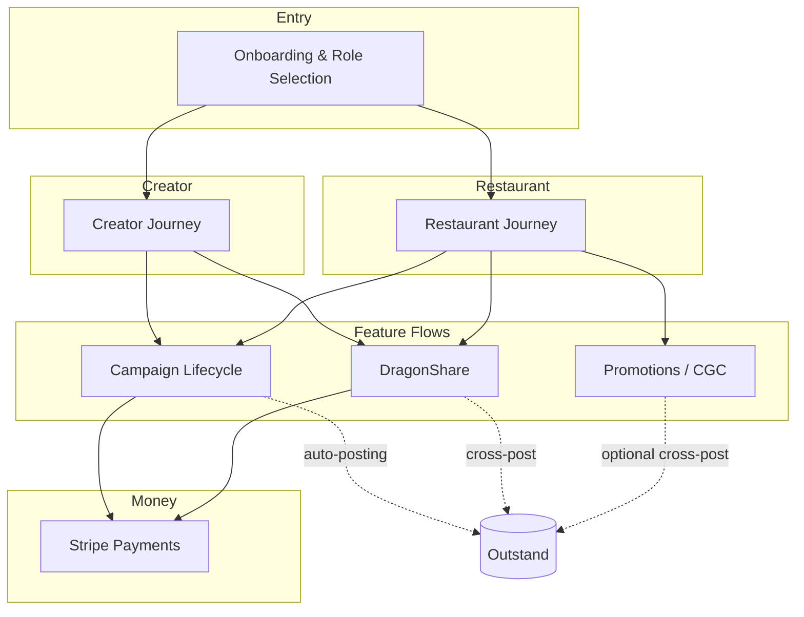

# DragonCandy Feature Flows

Visual, code-traced reference for how DragonCandy's core features actually work
end-to-end. Each page pairs a **high-level user-journey diagram** with a
**technical layer** — sequence/state diagrams plus tables of the real pages,
hooks, edge functions, database tables, and status transitions behind the flow.

These docs exist so the team can reason about and improve a feature without
re-tracing 73 edge functions and 183 hooks every time. All diagrams are
[Mermaid](https://mermaid.js.org) — they render natively on GitHub and Lovable
and diff cleanly in git.

> **Authoritative narrative for the campaign delivery state machines** lives in
> [`../content-delivery-system-flows.md`](../content-delivery-system-flows.md).
> These pages render the *visual* layer and add the download + auto-posting +
> money-movement paths that doc doesn't cover. Where they overlap, that doc owns
> the prose; this set owns the diagrams.

## System Map

## Pages

| Page | What it covers |
|------|----------------|
| [Campaign Lifecycle](./campaign-lifecycle.md) | Create → apply / counter-offer → collaboration → content delivery/approval → download → auto-posting |
| [DragonShare](./dragonshare.md) | Creator upload → watermark preview → boost-or-pass → two-path payment → fulfillment/payout → notification fanout |
| [Promotions / CGC](./promotions-cgc.md) | Promotion create → anonymous customer submission → review/approve → discount code → optional cross-post → notify |
| [Onboarding](./onboarding.md) | Signup → role selection → onboarding wizard (per role) → first-run missions per dashboard |
| [Stripe Payments](./stripe-payments.md) | Escrow, creator payout, sponsorship, DragonShare boost, Connect onboarding, take-rate ladder, `payment_events` ledger |
| [Creator Journey](./creator-journey.md) | The creator's cross-feature path through the app |
| [Restaurant Journey](./restaurant-journey.md) | The restaurant's cross-feature path through the app |

## Page Template

Every feature-flow page follows the same shape:

- **Overview** — what the flow is and who's involved
- **User Journey** — high-level Mermaid flowchart
- **Technical Flow** — Mermaid sequence and/or state diagram
- **Reference** — tables of Pages & Components · Hooks · Edge Functions · Tables & Status
- **Known Gaps / TODOs** — uncertainties surfaced while tracing the code
- **See Also** — cross-links to other flows and the wiki

## Conventions

- The **Brand/Sponsor** role is gated behind the `BRAND_ROLE_ENABLED` feature
  flag, so it has no standalone journey page. It appears where it intersects
  campaign sponsorship and payments.
- File paths are relative to the repo root (e.g. `src/pages/…`,
  `supabase/functions/…`).
- "Edge function" = a Deno function under `supabase/functions/`.

## Future Pages

Candidates for a second documentation pass (out of scope here):

- Messaging & realtime (conversations, presence, reactions)
- Donny AI orchestration internals (tool routing, cost ledger)
- Analytics & the data flywheel (`analytics_events`, `dragonshare_events`)
- Outstand account linking & reconciliation (currently summarized inline)
