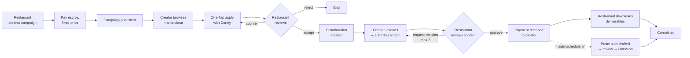
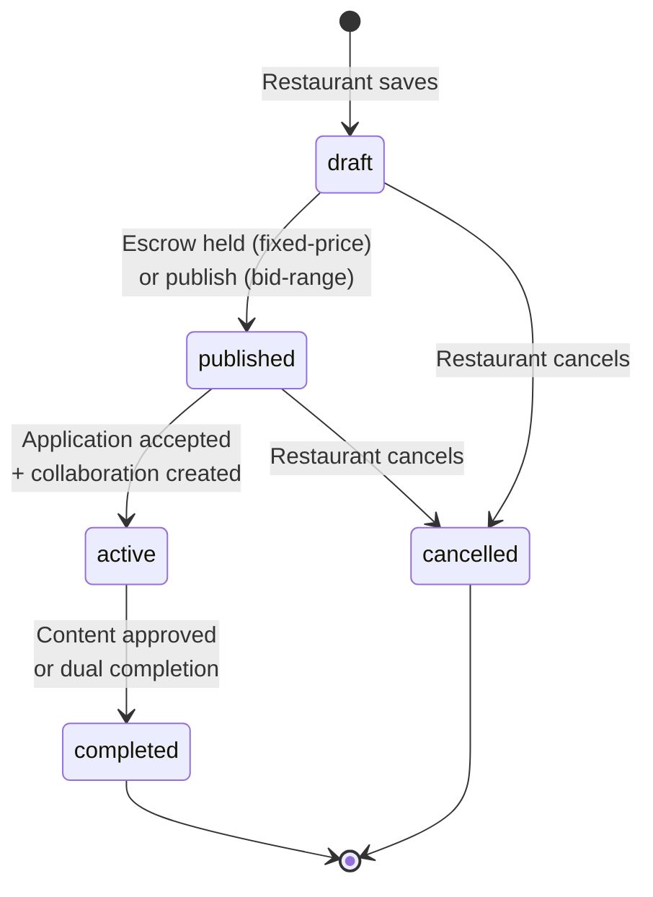
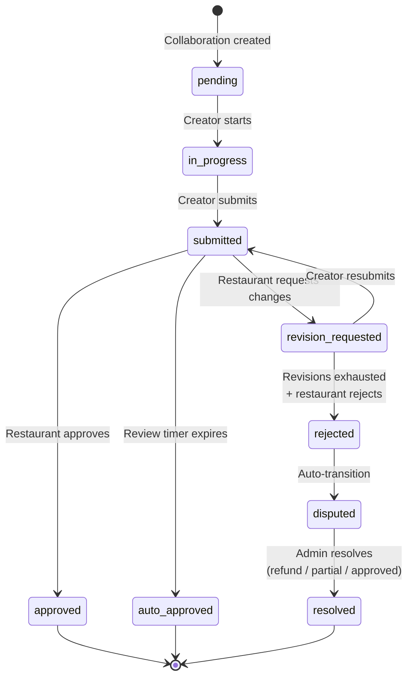
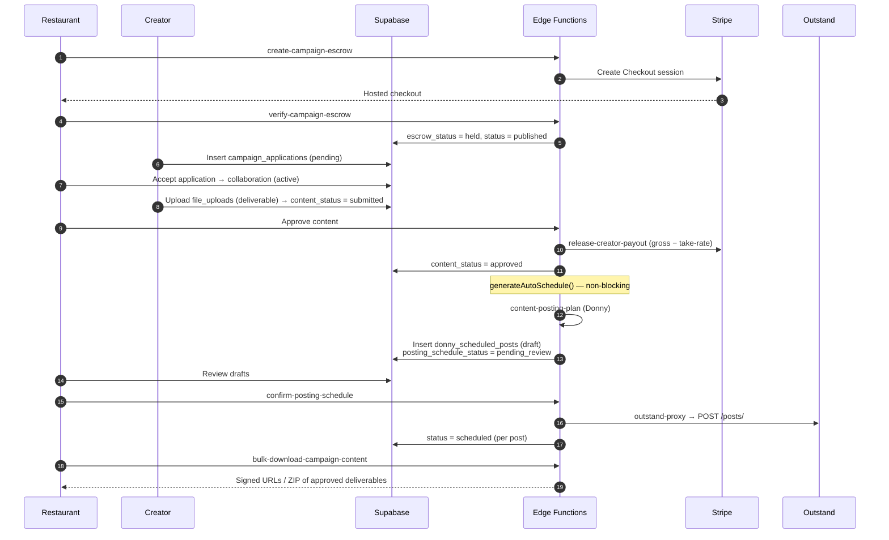

# Campaign Lifecycle

## Overview

The campaign lifecycle is DragonCandy's core marketplace flow: a **restaurant**
creates a campaign, a **creator** applies and is hired, the creator delivers
content, the restaurant approves it, payment is released, and — optionally — the
approved content is auto-scheduled across the restaurant's social platforms via
[Outstand](../wiki/entities/outstand.md). A **brand** may sponsor a campaign and
co-approve creators (sponsorship details live in [Stripe Payments](./stripe-payments.md)).

This page is the **visual** companion to
[`../content-delivery-system-flows.md`](../content-delivery-system-flows.md),
which remains the authoritative prose reference for the state machines. The two
sections this page **uniquely owns** are the **download** and **auto-posting**
paths, which that doc does not cover.

## User Journey

## Technical Flow

### Campaign status state machine

`campaigns.status` — see also `campaigns.escrow_status`
(`none → pending → held → released / refunded`).

### Content delivery state machine

`campaign_collaborations.content_status`. Auto-approval timer starts on
`submitted`. Base window by delivery type: **Standard 48h · Expedited 24h ·
DragonRush 4h**. The campaign owner may extend **once** (the `extend-review`
function flips `review_extended` from `false` → `true`, only while status is
`submitted`), adding **+24h / +24h / +2h** respectively — so the worst-case
totals are 72h / 48h / 6h. `auto-approve-content` (cron) reads `review_extended`
when computing expiry and auto-approves once the window elapses.

### End-to-end sequence (hire → payout → download → auto-post)

### Download path (restaurant retrieves deliverables)

The restaurant downloads approved deliverables from the campaign content gallery.
`bulk-download-campaign-content` verifies the caller owns the campaign (or is an
active org member), pulls `file_uploads` where `file_category = 'deliverable'`
and `upload_status = 'completed'`, and returns signed URLs (3600s expiry).

### Auto-posting path (approved content → social)

Triggered **inside** `release-creator-payout` via the non-blocking
`generateAutoSchedule()` helper — failures are logged and never block the payout:

1. Skip unless `campaigns.posting_preferences.auto_schedule_on_approval` is set.
2. Load completed deliverables and the restaurant's connected
   `business_outstand_accounts`; skip if either is empty.
3. Sign each deliverable URL, call `content-posting-plan` (Donny generates
   captions + best-practice scheduled times per platform).
4. Insert draft `donny_scheduled_posts` (`status = 'draft'`, shared
   `plan_group_id`) and set `campaigns.posting_schedule_status = 'pending_review'`.
5. The restaurant reviews/edits drafts, then `confirm-posting-schedule` queues
   each post to Outstand through `outstand-proxy` and flips its status to
   `scheduled`. Outstand publishes at `scheduled_at`.
6. When Outstand publishes (or fails), it calls the `outstand-webhook` edge
   function (`post.published` / `post.error`), which advances the row to
   `published` (with `published_at`) or `failed`. `account.token_expired` events
   mark the connected account for reconnect.

## Reference

### Pages & Components

| Name | Path | Role |
|------|------|------|
| `CampaignCreator` | `src/pages/CampaignCreator.tsx` | Restaurant / Brand |
| `CampaignDetailsPage` | `src/pages/CampaignDetailsPage.tsx` | Restaurant (primary workspace) |
| `ApplicationsListFixed` | `src/components/campaigns/ApplicationsListFixed.tsx` | Restaurant |
| `JointApprovalCard` | `src/components/campaigns/…` | Restaurant + Brand (sponsored) |
| `OneTapApplySheet` | `src/components/campaigns/OneTapApplySheet.tsx` | Creator |
| `ProjectFileUpload` | `src/components/projects/ProjectFileUpload.tsx` | Creator |
| `ContentReviewSection` | `src/components/campaigns/detail/ContentReviewSection.tsx` | Restaurant |
| `CampaignContentGallery` | `src/components/campaigns/CampaignContentGallery.tsx` | Restaurant (download) |
| `PostingPlanReview` | `src/components/outstand/PostingPlanReview.tsx` | Restaurant (auto-posting) |
| `ScheduleReviewScreen` | `src/components/schedule/ScheduleReviewScreen.tsx` | Restaurant |

### Hooks

| Hook | Path | Purpose |
|------|------|---------|
| `useCreateCampaign` / `useUpdateCampaign` | `src/hooks/useCampaignMutations.ts` | Create / publish campaigns |
| `useEscrowCheckout` | `src/hooks/useEscrowCheckout.tsx` | Start Stripe escrow (fixed-price) |
| `useCreateApplication` | `src/hooks/useCreateApplication.ts` | Creator applies |
| `useManageApplication` | `src/hooks/useManageApplication.ts` | Accept / reject / counter |
| `useFileUploadMutations` | `src/hooks/useFileUploadMutations.ts` | Upload / submit deliverables |
| `useProjectComplete` | `src/hooks/useProjectComplete.ts` | Dual-completion handshake |
| `useScheduledPosts` | `src/hooks/useScheduledPosts.ts` | Read draft/scheduled posts |

### Edge Functions

| Function | Path | Trigger |
|----------|------|---------|
| `create-campaign-escrow` | `supabase/functions/create-campaign-escrow/` | Publish fixed-price campaign |
| `verify-campaign-escrow` | `supabase/functions/verify-campaign-escrow/` | Return from Stripe Checkout |
| `release-creator-payout` | `supabase/functions/release-creator-payout/` | Content approved → payout (+ auto-schedule) |
| `auto-approve-content` | `supabase/functions/auto-approve-content/` | Cron: expired review windows |
| `reject-content` | `supabase/functions/reject-content/` | Revisions exhausted → dispute |
| `resolve-dispute` | `supabase/functions/resolve-dispute/` | Admin resolves dispute |
| `content-posting-plan` | `supabase/functions/content-posting-plan/` | Generate AI posting plan |
| `confirm-posting-schedule` | `supabase/functions/confirm-posting-schedule/` | Queue drafts to Outstand |
| `outstand-proxy` | `supabase/functions/outstand-proxy/` | Server-side Outstand API gateway |
| `bulk-download-campaign-content` | `supabase/functions/bulk-download-campaign-content/` | Restaurant downloads deliverables |

### Tables & Status

| Table | Key status field | Transitions |
|-------|------------------|-------------|
| `campaigns` | `status` | `draft → published → active → completed` (or `cancelled`) |
| `campaigns` | `escrow_status` | `none → pending → held → released / refunded` |
| `campaigns` | `posting_schedule_status` | `pending_review → confirmed` |
| `campaign_applications` | `status` | `pending → accepted / rejected / counter_offered` |
| `campaign_applications` | `final_approval_status` | `pending → approved / rejected` (sponsored; via `trg_recompute_final_approval`) |
| `application_counter_offers` | — | Negotiation records |
| `campaign_collaborations` | `content_status` | see content-delivery state machine above |
| `file_uploads` | `upload_status` | `… → completed` (`file_category = 'deliverable'`) |
| `donny_scheduled_posts` | `status` | `draft → scheduled → published / failed` (terminal set by `outstand-webhook`) |

## Known Gaps / TODOs

- **`in_progress` enum gap (known):** the `campaign_status` enum is missing an
  `in_progress` value that ~11 source files reference. Add the enum value before
  it bites a live collaboration flow (tracked in `PROJECT_CONTEXT.md` §6).
- **Disputes are backend-only (confirmed gap):** `resolve-dispute` is fully
  implemented (outcomes `refund` / `partial_payment` / `approved`) but requires
  the **service-role key** and has **no frontend caller**. `AdminRoute` exists but
  is wired into zero routes, so no in-app admin surface can trigger it today.

## See Also

- [`../content-delivery-system-flows.md`](../content-delivery-system-flows.md) — authoritative prose state machines
- [Stripe Payments](./stripe-payments.md) — escrow, payout, sponsorship money movement
- [Restaurant Journey](./restaurant-journey.md) · [Creator Journey](./creator-journey.md)
- Wiki: [[Campaign Lifecycle]] · [[Content Delivery State Machine]] · [[Outstand]]
