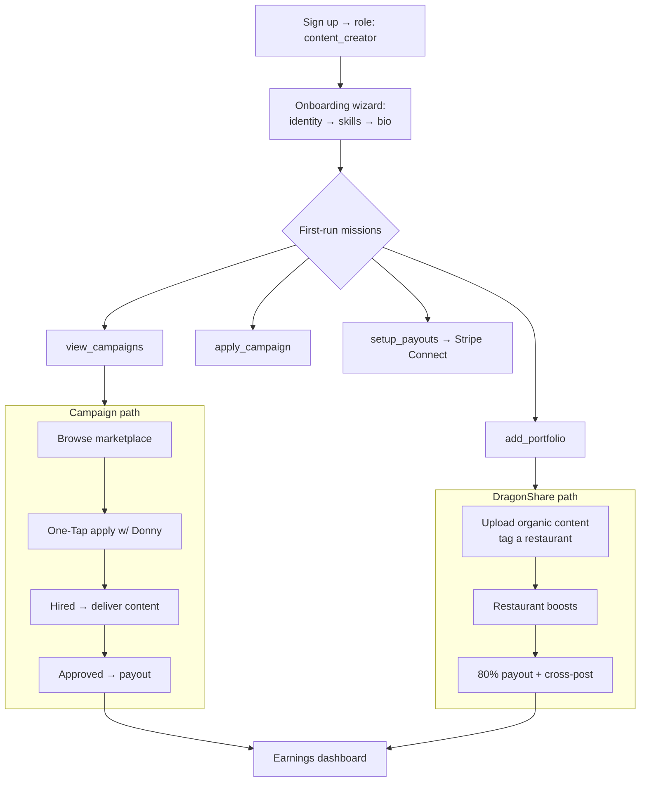

# Creator Journey

## Overview

This is the **content creator's** path across the whole product — the connective
map that stitches the feature flows together. It links out to the detailed pages
rather than restating their diagrams. A creator's two earning paths are
**campaigns** (apply → deliver → get paid) and **DragonShare** (post organically →
get boosted).

## Journey Map

## Stages

| Stage | Where | Detail |
|-------|-------|--------|
| Onboarding | `/auth` → `/profile/onboarding` → `/dashboard/creator` | [Onboarding](./onboarding.md) (creator missions: `view_campaigns`, `add_portfolio`, `apply_campaign`, `setup_payouts`) |
| Discover & apply | `/dashboard/creator/campaigns` | [Campaign Lifecycle → apply](./campaign-lifecycle.md) |
| Deliver content | `/dashboard/creator/my-campaigns/:id` | [Campaign Lifecycle → content delivery](./campaign-lifecycle.md) |
| DragonShare | `/dashboard/creator` (CreatorDragonShare) | [DragonShare](./dragonshare.md) |
| Get paid | `/dashboard/creator/earnings` | [Stripe Payments → payout](./stripe-payments.md) |

## Key Surfaces

| Page | Path |
|------|------|
| Creator dashboard | `src/pages/CreatorDashboard.tsx` |
| Campaign marketplace | `src/pages/CreatorCampaignMarketplace.tsx` |
| My campaigns | `src/pages/MyCampaignsPage.tsx` / `MyCampaignDetailPage.tsx` |
| DragonShare | `src/pages/CreatorDragonShare.tsx` |
| Earnings | `src/pages/CreatorEarnings.tsx` |
| Settings (Connect, profile) | `src/pages/CreatorSettings.tsx` |

## See Also

- [Onboarding](./onboarding.md) · [Campaign Lifecycle](./campaign-lifecycle.md) · [DragonShare](./dragonshare.md) · [Stripe Payments](./stripe-payments.md)
- [Restaurant Journey](./restaurant-journey.md) — the counterpart role
