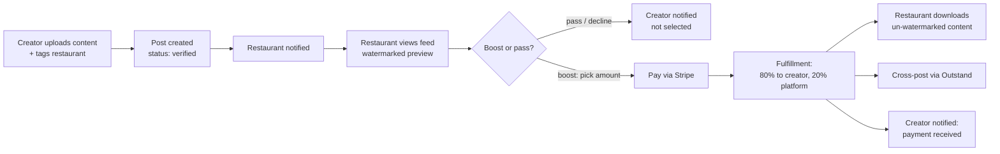
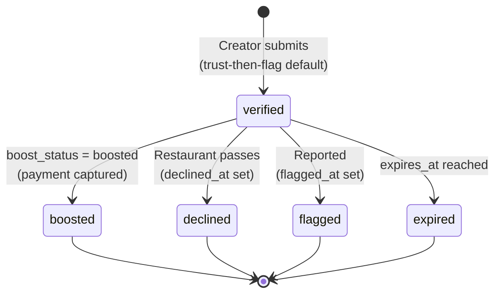
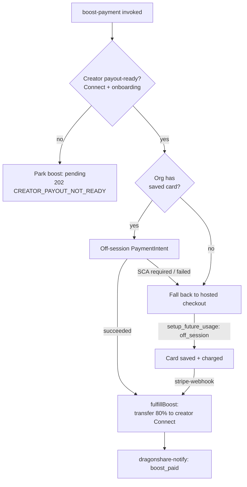

# DragonShare

## Overview

DragonShare is the amplification engine: **creators** upload organic content
about a restaurant, and the **restaurant** can boost it with a payment to
cross-post it across its connected social channels (via
[Outstand](../wiki/entities/outstand.md)). Payments run on Stripe Connect with an
**80/20 creator/platform split**. The model is **trust-then-flag** — submitted
posts default to `verified` (no admin verification queue); inappropriate content
is reported after the fact via a flag.

Money mechanics are detailed in [Stripe Payments](./stripe-payments.md); this
page focuses on the content + decision + notification flow.

## User Journey

## Technical Flow

### Post status (`dragonshare_posts`)

The org-facing feed (`useOrgDragonSharePosts`) only shows posts where
`status = 'verified'` **and** `flagged_at IS NULL` **and** `declined_at IS NULL`.

`boost_status` on the post moves `available → boosted` (or `expired` / `withdrawn`).

### Boost payment — two paths

`boost-payment` validates the caller is an org owner/admin and creates a boost
row, then **checks the creator is payout-ready** (has a Stripe Connect account
with onboarding complete). If not, the boost is **parked** without charging
(`CREATOR_PAYOUT_NOT_READY`, HTTP 202, boost stays `pending`). Otherwise it
charges — and the charge **path depends on whether the org has a saved card:**

`fulfillBoost` (`_shared/fulfill-boost.ts`) re-verifies Connect readiness, makes
the transfer, and records a `dragonshare_payouts` row (`succeeded`); it throws if
the creator still isn't onboarded.

- Off-session success returns inline; checkout returns `{ checkout_url, boost_id }`
  and completes on the Stripe webhook.
- `fulfillBoost` (`_shared/fulfill-boost.ts`) performs the Connect transfer and
  records the payout.

### Notification fanout

`dragonshare-notify` is the single owner of DragonShare delivery (raw push
inserts were retired). Each event fans out to the **bell notification**, a
**Donny nudge**, and a **Donny chat message**:

| Event | Fired when | Recipient |
|-------|------------|-----------|
| `submission` | Creator submits a post | Restaurant (org owner) |
| `boost_paid` | Boost payment captured | Creator (paid) + restaurant (draft ready) |
| `declined` | Restaurant passes | Creator (not selected) |

## Reference

### Pages & Components

| Name | Path | Role |
|------|------|------|
| `CreatorDragonShare` | `src/pages/CreatorDragonShare.tsx` | Creator hub (submitted / boosted / expired) |
| `BusinessDragonShare` | `src/pages/BusinessDragonShare.tsx` | Restaurant / Brand boost feed |
| `DragonShareInlineForm` / `DragonShareSubmitSheet` | `src/components/dragonshare/` | Submit (desktop / mobile) |
| `DragonShareUploadArea` | `src/components/dragonshare/DragonShareUploadArea.tsx` | File upload |
| `RestaurantTypeahead` | `src/components/dragonshare/RestaurantTypeahead.tsx` | Target restaurant search |
| `WatermarkedMedia` | `src/components/dragonshare/WatermarkedMedia.tsx` | Pre-payment preview |
| `DragonSharePostCard` | `src/components/dragonshare/DragonSharePostCard.tsx` | Boost decision card |
| `BoostConfirmationSheet` | `src/components/dragonshare/BoostConfirmationSheet.tsx` | Amount + split confirm |
| `DragonShareActivityCard` | `src/components/dragonshare/DragonShareActivityCard.tsx` | Dashboard activity feed |

### Hooks

| Hook | Path | Purpose |
|------|------|---------|
| `useCreatorDragonSharePosts` / `useOrgDragonSharePosts` | `src/hooks/useDragonShare.ts` | Read posts (creator / org feed) |
| `useSubmitDragonSharePost` | `src/hooks/useDragonShare.ts` | Submit post + fire notify |
| `useOrgBoostStats` / `useCreatorDragonShareEarnings` | `src/hooks/useDragonShare.ts` | Spend / earnings stats |
| `useDragonShareUpload` | `src/hooks/useDragonShareUpload.ts` | Upload to storage |
| `useFlagDragonSharePost` / `useDeclineDragonSharePost` | `src/hooks/…` | Flag / pass |
| `useAmplificationPreview` | `src/hooks/useAmplificationPreview.ts` | Connected platforms preview |

### Edge Functions

| Function | Path | Trigger |
|----------|------|---------|
| `boost-payment` | `supabase/functions/boost-payment/` | Restaurant boosts a post |
| `dragonshare-notify` | `supabase/functions/dragonshare-notify/` | submit / boost / decline events |
| `get-watermarked-preview` | `supabase/functions/get-watermarked-preview/` | Signed URL for content, gated by boost/approval (watermark itself is client-side — see below) |
| `fire-dragonshare-social-hook` | `supabase/functions/fire-dragonshare-social-hook/` | Cross-post after boost |

### Tables & Status

| Table | Key status field | Transitions |
|-------|------------------|-------------|
| `dragonshare_posts` | `status` | default `verified` → `declined` / `flagged` / `expired` |
| `dragonshare_posts` | `boost_status` | `available → boosted` (or `expired` / `withdrawn`) |
| `dragonshare_boosts` | `status` | `pending → captured → transferred` (or `refunded` / `failed`) |
| `dragonshare_payouts` | `status` | `pending → succeeded` (or `failed` / `reversed`) |

> `content_file_path` on a post is a **public URL** — use it directly as an
> `img`/`video` src; do not wrap it in `useSignedUrl`.

> **The watermark is a client-side overlay**, not a generated asset.
> `WatermarkedMedia` renders a repeating "DragonCandy • PREVIEW" CSS overlay when
> `watermark={true}` (shown until a post is boosted; the creator sees their own
> posts un-watermarked). `get-watermarked-preview` itself just returns a signed
> URL and enforces download access by boost/approval status — it does not bake a
> watermark into the media.

## Known Gaps / TODOs

- **Submission is not gated on creator Connect.** A creator can submit before
  setting up payouts; readiness is enforced later at boost time (the boost parks
  as `pending` if the creator isn't onboarded). A mechanism that **auto-retries a
  parked boost** once the creator finishes Connect onboarding was not confirmed —
  parked boosts may sit `pending` until manually retried.
- **`dragonshare_engagement`** is schema-only (not populated) — engagement
  metrics are not yet wired.

## See Also

- [Stripe Payments](./stripe-payments.md) — boost charge, split, Connect transfer
- [Creator Journey](./creator-journey.md) · [Restaurant Journey](./restaurant-journey.md)
- Wiki: [[DragonShare]] · [[Trust-Then-Flag Model]] · [[Two-Path Boost Payment]] · [[Outstand]]
