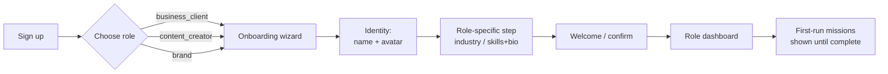
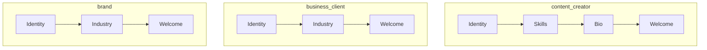
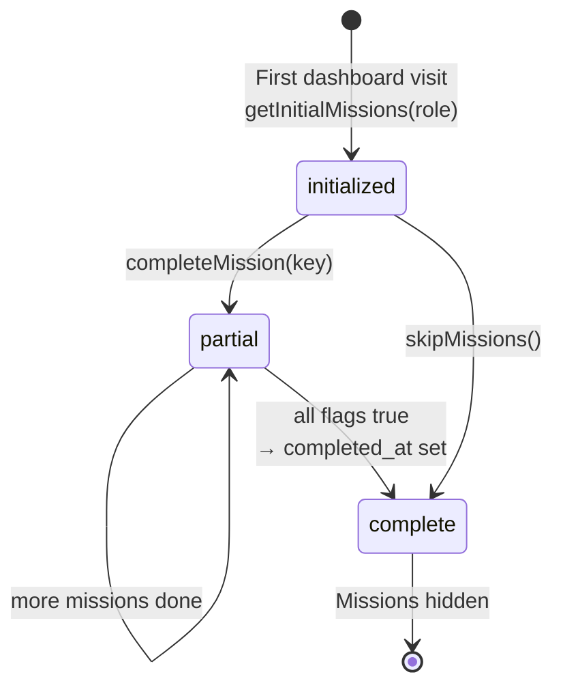
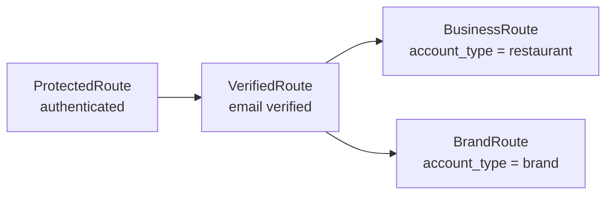

# Onboarding

## Overview

Onboarding takes a new user from signup to a role-tailored dashboard with a set of
**first-run missions** that turn setup into a sense of progress ("setup disguised
as action"). The flow has three parts: **role selection** (business / creator /
brand), a short **onboarding wizard** whose steps depend on the role, and
**first-run missions** rendered on each dashboard and tracked in
`profiles.first_run_missions` (a JSONB column — not the legacy
`onboarding_steps` / `user_onboarding_progress` tables).

## User Journey

## Technical Flow

### Wizard steps per role

### First-run missions per role

Stored in `profiles.first_run_missions`; `isFirstRun` is true while missions
exist but `completed_at` is unset. Completion is **explicit** — the UI calls
`completeMission(key)` when the user performs the action (no auto-detection).

| Role | Missions (`first_run_missions` keys) |
|------|--------------------------------------|
| `business_client` | `browse_inspiration` · `create_campaign` · `launch_campaign` · `setup_payments` |
| `content_creator` | `view_campaigns` · `add_portfolio` · `apply_campaign` · `setup_payouts` |
| `brand` | `select_style` · `browse_creators` · `create_sponsorship` |

### Route guards (post-onboarding)

## Reference

### Pages & Components

| Name | Path | Role |
|------|------|------|
| `AuthPage` | `src/pages/AuthPage.tsx` | All (login/signup + role selection) |
| `RoleSelection` | `src/components/auth/RoleSelection.tsx` | All |
| `ProfileSetup` | `src/pages/ProfileSetup.tsx` | All (wizard wrapper) |
| `OnboardingWizard` | `src/components/onboarding/OnboardingWizard.tsx` | All (role-specific steps) |
| `IdentityStep` / `BioStep` / `WelcomeStep` | `src/components/onboarding/steps/` | All |
| `TapGrid` | `src/components/onboarding/TapGrid.tsx` | Industry / skills selectors |
| `OnboardingProgress` | `src/components/onboarding/OnboardingProgress.tsx` | Progress tracker |

### Hooks & Types

| Item | Path | Purpose |
|------|------|---------|
| `useFirstRunMissions` | `src/hooks/useFirstRunMissions.ts` | Read/update missions, `completeMission`, `skipMissions`, `isFirstRun` |
| `firstRun` types + helpers | `src/types/firstRun.ts` | `parseFirstRunMissions`, `getInitialMissions`, `areMissionsComplete` |

### Edge Functions

None dedicated — RLS on `profiles` lets users update their own
`first_run_missions`. `useFirstRunMissions` fires fire-and-forget analytics events
(`first_run_mission_complete`, `first_run_all_complete`, `first_run_skipped`).

### Tables & Status

| Table | Field | Notes |
|-------|-------|-------|
| `profiles` | `first_run_missions` (JSONB) | Role-shaped; `completed_at` marks done |
| `onboarding_steps` / `user_onboarding_progress` | — | Legacy/unused vs. the JSONB approach — see gaps |

## Known Gaps / TODOs

- **Legacy tables** — `onboarding_steps` and `user_onboarding_progress` exist but
  the live flow uses `profiles.first_run_missions`. Confirm the legacy tables are
  dead before relying on (or removing) them.
- **No partial wizard save** — closing the wizard mid-step loses entered state.
- **No mission auto-detection** — missions only advance when the UI explicitly
  calls `completeMission(key)`; an action done outside the expected surface may
  not tick its mission.
- **Brand role** is feature-flagged (`BRAND_ROLE_ENABLED`); its missions exist in
  code but the role is gated.

## See Also

- [Creator Journey](./creator-journey.md) · [Restaurant Journey](./restaurant-journey.md)
- Wiki: [[DragonCandy Platform]]
