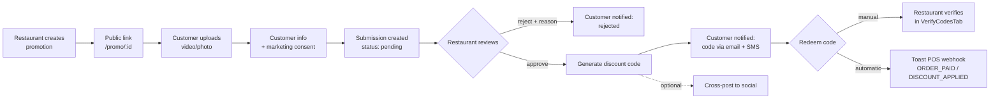
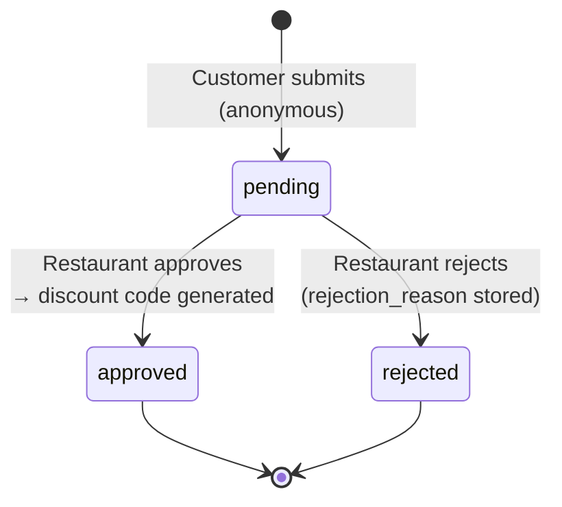
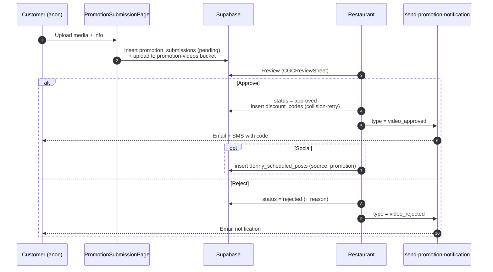

# Promotions / Customer-Generated Content (CGC)

## Overview

Promotions let a **restaurant** collect content directly from its **customers**
in exchange for a discount. The restaurant creates a promotion; a customer visits
a public link and submits a video/photo **anonymously** (no login); the restaurant
reviews and approves; an approved submission generates a **discount code** sent to
the customer, and can optionally be cross-posted to social via
[Outstand](../wiki/entities/outstand.md).

The defining constraint: **customer submission is anonymous** — storage and RLS
allow inserts with `auth.uid() IS NULL`, so the schema must match the public form
exactly (a missing column silently breaks submission in prod, not just the build).

## User Journey

## Technical Flow

### Submission status (`promotion_submissions`)

A unique index on `(promotion_id, customer_email)` blocks duplicate submissions
per customer per promotion. If the DB insert fails after the file upload, the
orphaned upload is explicitly cleaned up.

### Approval → code → notify

`send-promotion-notification` sends email via **Resend** and SMS via **Twilio**
(SMS fires only on approval, carrying the discount code).

### Redemption (manual + Toast POS)

A discount code can be redeemed two ways:

- **Manual** — the restaurant verifies the code in `VerifyCodesTab`
  (`usePromotions.redeemCode`), which sets `is_redeemed = true` and increments
  `promotions.current_redemptions`.
- **Automatic via Toast** — for restaurants that connected Toast (OAuth via
  `toast-oauth-start` / `toast-oauth-callback`, discounts pushed by
  `toast-discount-push`), the `toast-redemption-webhook` marks the code redeemed
  when Toast emits `ORDER_PAID` / `DISCOUNT_APPLIED`. It is HMAC-verified and
  idempotent via `toast_sync_events`.

## Reference

### Pages & Components

| Name | Path | Role |
|------|------|------|
| `BusinessPromotionalTools` | `src/pages/BusinessPromotionalTools.tsx` | Restaurant (manage promotions + library) |
| `PromotionSubmissionPage` | `src/pages/PromotionSubmissionPage.tsx` | Customer (public, `/promo/:promotionId`) |
| `CreatePromotionModal` / `EditPromotionModal` | `src/components/promotions/` | Restaurant |
| `CGCReviewSheet` | `src/components/promotions/CGCReviewSheet.tsx` | Restaurant (approve / reject) |
| `CGCContentLibrary` | `src/components/promotions/CGCContentLibrary.tsx` | Restaurant (filter submissions) |
| `VerifyCodesTab` | `src/components/promotions/VerifyCodesTab.tsx` | Restaurant (redeem codes) |
| `VideoUploader` / `CustomerInfoForm` / `SocialHandleFields` | `src/components/…` | Customer form steps |

### Hooks

| Hook | Path | Purpose |
|------|------|---------|
| `usePromotions` | `src/hooks/usePromotions.ts` | Create/update promotions, review submissions, redeem codes |
| `usePromotionSubmission` | `src/hooks/usePromotionSubmission.ts` | Anonymous customer submit + duplicate check |

### Edge Functions

| Function | Path | Trigger |
|----------|------|---------|
| `send-promotion-notification` | `supabase/functions/send-promotion-notification/` | On approve / reject — email (Resend) + SMS (Twilio) |
| `fire-promotion-social-hook` | `supabase/functions/fire-promotion-social-hook/` | Cross-post an approved submission |
| `toast-redemption-webhook` | `supabase/functions/toast-redemption-webhook/` | Toast `ORDER_PAID` / `DISCOUNT_APPLIED` → auto-redeem code |
| `toast-oauth-start` / `toast-oauth-callback` | `supabase/functions/toast-oauth-*/` | Connect a restaurant's Toast account |
| `toast-discount-push` | `supabase/functions/toast-discount-push/` | Push a discount to Toast |

### Tables & Status

| Table | Key status field | Transitions |
|-------|------------------|-------------|
| `promotions` | `status` | `active ↔ paused` (implicit `expired` past `end_date`) |
| `promotion_submissions` | `status` | `pending → approved / rejected` (anonymous insert RLS) |
| `discount_codes` | `is_redeemed` | `false → true` (manual or Toast webhook; increments `current_redemptions`) |
| `donny_scheduled_posts` | `status` | `scheduled → published` (metadata `source: 'promotion'`) |
| `toast_sync_events` | — | Idempotency log for Toast redemption webhooks |

## Known Gaps / TODOs

- **One shot per customer** — once a submission is `approved` or `rejected` its
  status is terminal (`status IN ('pending','approved','rejected')`) and a
  `(promotion_id, customer_email)` unique index blocks re-submission, so a
  customer effectively gets a single attempt per promotion (no reopen path).
- **Toast is opt-in** — automatic redemption only applies to restaurants that
  connected Toast; everyone else relies on manual verification in `VerifyCodesTab`.

## See Also

- [Restaurant Journey](./restaurant-journey.md)
- [DragonShare](./dragonshare.md) — the other creator/customer content path
- Wiki: [[DragonCandy Platform]] · [[Outstand]]
