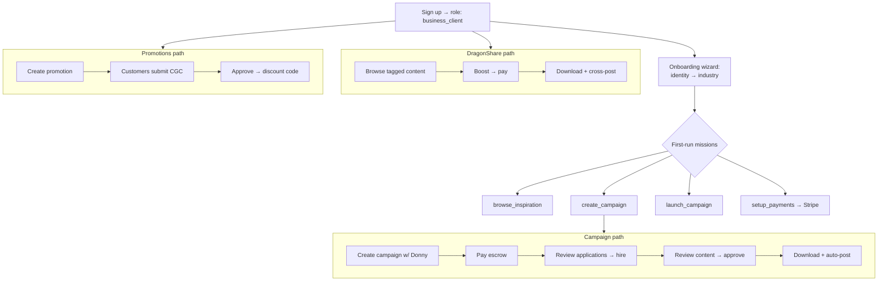

# Restaurant Journey

## Overview

This is the **restaurant's** (business client) path across the whole product — the
connective map that stitches the feature flows together, linking out rather than
restating their diagrams. A restaurant has three ways to get content: **campaigns**
(hire creators), **DragonShare** (boost organic creator posts), and **promotions**
(collect customer-generated content for a discount).

## Journey Map

## Stages

| Stage | Where | Detail |
|-------|-------|--------|
| Onboarding | `/auth` → `/profile/onboarding` → `/dashboard/business` | [Onboarding](./onboarding.md) (restaurant missions: `browse_inspiration`, `create_campaign`, `launch_campaign`, `setup_payments`) |
| Run a campaign | `/dashboard/business/campaigns` | [Campaign Lifecycle](./campaign-lifecycle.md) |
| Pay & release | escrow → payout | [Stripe Payments](./stripe-payments.md) |
| Download & auto-post | Campaign content gallery | [Campaign Lifecycle → download / auto-posting](./campaign-lifecycle.md) |
| Boost organic content | `/dashboard/business` (BusinessDragonShare) | [DragonShare](./dragonshare.md) |
| Collect CGC | `/dashboard/business` (BusinessPromotionalTools) | [Promotions / CGC](./promotions-cgc.md) |

## Key Surfaces

| Page | Path |
|------|------|
| Business dashboard | `src/pages/BusinessDashboard.tsx` |
| Campaign creator | `src/pages/CampaignCreator.tsx` |
| Campaign details (workspace) | `src/pages/CampaignDetailsPage.tsx` |
| DragonShare | `src/pages/BusinessDragonShare.tsx` |
| Promotional tools | `src/pages/BusinessPromotionalTools.tsx` |
| Settings (Connect, Outstand, profile) | `src/pages/BusinessSettings.tsx` |

## See Also

- [Onboarding](./onboarding.md) · [Campaign Lifecycle](./campaign-lifecycle.md) · [DragonShare](./dragonshare.md) · [Promotions / CGC](./promotions-cgc.md) · [Stripe Payments](./stripe-payments.md)
- [Creator Journey](./creator-journey.md) — the counterpart role
