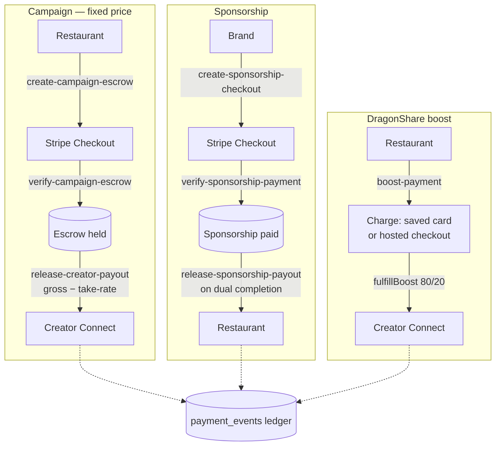
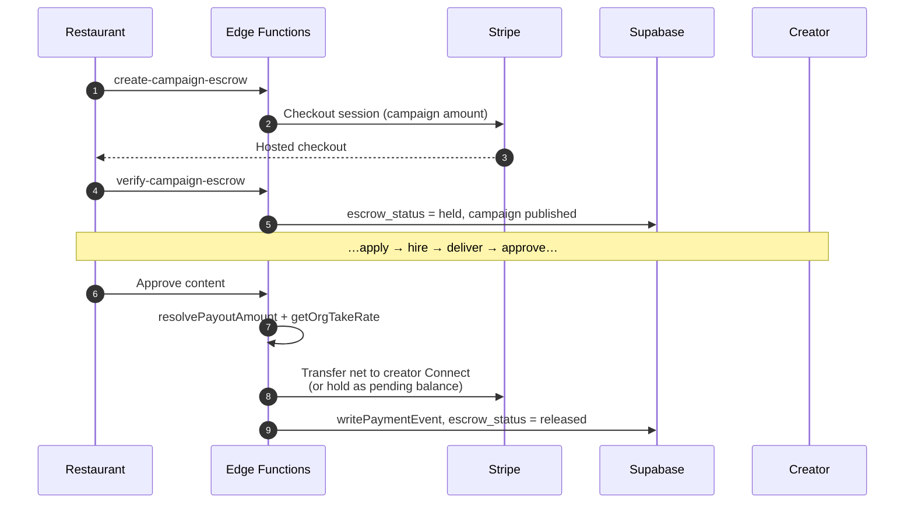

# Stripe Payments

## Overview

Every dollar that moves through DragonCandy runs on **Stripe Connect (test mode)**
and is recorded in the `payment_events` ledger. There are four payment surfaces,
all sharing the same take-rate ladder and ledger discipline:

1. **Campaign escrow + creator payout** — restaurant pre-funds a fixed-price
   campaign; funds release to the creator on approval.
2. **Sponsorship** — a brand pays to sponsor a campaign; funds release to the
   restaurant on dual completion.
3. **DragonShare boost** — a restaurant boosts creator content (80/20 split).
4. **Connect onboarding** — creators/orgs connect a Stripe account to receive
   transfers.

This page is the money-movement reference; the feature context lives in
[Campaign Lifecycle](./campaign-lifecycle.md) and [DragonShare](./dragonshare.md).

## Take-Rate Ladder

Platform fee per transaction via `getOrgTakeRate()` (`_shared/platform-fee.ts`):

| Plan | Monthly | Take rate |
|------|---------|-----------|
| Free | — | 10% |
| Starter | $149 | 7% |
| Growth | $499 | 5% |
| Pro | $999 | 3% |
| Enterprise | Custom | 2% |

DragonShare boosts use a fixed 20% platform fee (80% to creator), independent of
the ladder above.

## Money Movement



## Technical Flow

### Campaign escrow + payout sequence



**Payout math** (`release-creator-payout`):

```
gross        = creator_agreed_rate ?? application.proposed_rate
platform_fee = gross × getOrgTakeRate(org)
net_payout   = gross − platform_fee
creator_net  = net_payout − Stripe fee (~2.9% + $0.30)
```

### DragonShare boost charge

Two-path charge (saved card off-session, else hosted checkout that saves the
card), then `fulfillBoost` transfers the creator's 80%. See
[DragonShare → Boost payment](./dragonshare.md#boost-payment--two-paths).

### Async settlement

`stripe-webhook` reconciles asynchronous outcomes (checkout completion, transfer
status, refunds) and updates the relevant rows + `payment_events`. Treat the
webhook — not the synchronous response — as the source of truth for
checkout-based charges.

## Reference

### Hooks

| Hook | Path | Purpose |
|------|------|---------|
| `useEscrowCheckout` | `src/hooks/useEscrowCheckout.tsx` | Start campaign escrow checkout |
| `useProjectComplete` | `src/hooks/useProjectComplete.ts` | Dual completion → payout trigger |
| `useCampaignSponsorship` | `src/hooks/useCampaignSponsorship.ts` | Read active sponsorship |

### Edge Functions

| Function | Path | Trigger |
|----------|------|---------|
| `create-campaign-escrow` | `supabase/functions/create-campaign-escrow/` | Publish fixed-price campaign |
| `verify-campaign-escrow` | `supabase/functions/verify-campaign-escrow/` | Return from checkout |
| `release-creator-payout` | `supabase/functions/release-creator-payout/` | Content approved / auto-approved / dual completion |
| `create-sponsorship-checkout` | `supabase/functions/create-sponsorship-checkout/` | Brand pays sponsorship |
| `verify-sponsorship-payment` | `supabase/functions/verify-sponsorship-payment/` | Return from sponsorship checkout |
| `release-sponsorship-payout` | `supabase/functions/release-sponsorship-payout/` | Both confirm sponsorship completion |
| `boost-payment` | `supabase/functions/boost-payment/` | DragonShare boost |
| `create-creator-connect-account` | `supabase/functions/create-creator-connect-account/` | Connect onboarding for payouts |
| `resolve-dispute` | `supabase/functions/resolve-dispute/` | Admin refund / partial / payout |
| `stripe-webhook` | `supabase/functions/stripe-webhook/` | Async Stripe event reconciliation |

Shared helpers: `_shared/platform-fee.ts` (`getOrgTakeRate`, `calculatePlatformFee`),
`_shared/pricing-utils.ts` (`resolvePayoutAmount`), `_shared/payment-events.ts`
(`writePaymentEvent`), `_shared/fulfill-boost.ts` (`fulfillBoost`).

### Tables & Status

| Table | Key status field | Transitions |
|-------|------------------|-------------|
| `campaigns` | `escrow_status` | `none → pending → held → released / refunded` |
| `campaign_sponsorships` | `payment_status` / `status` | `… → paid`; `pending → accepted → completed` |
| `dragonshare_boosts` | `status` | `pending → captured → transferred` (or `refunded` / `failed`) |
| `dragonshare_payouts` | `status` | `pending → succeeded` (or `failed` / `reversed`) |
| `payment_events` | — | Append-only ledger of all payment lifecycle events |
| `stripe_webhook_events` | — | Raw inbound Stripe event log |
| `rush_surcharge_log` | — | DragonDash rush surcharge records |

## Known Gaps / TODOs

- **Pending-balance vs. instant transfer** — `release-creator-payout` can either
  transfer to a connected account or hold a pending balance when the creator has
  no Connect account yet; the reconciliation of pending balances on later Connect
  onboarding wasn't fully traced.
- **Dispute admin surface** — `resolve-dispute` exists; the admin UI invoking it
  was not located.
- **Test mode only** — all keys are Stripe **test** keys; never switch to live
  without explicit approval.

## See Also

- [Campaign Lifecycle](./campaign-lifecycle.md) · [DragonShare](./dragonshare.md)
- Wiki: [[Stripe Connect]] · [[Take-Rate Ladder]] · [[Two-Path Boost Payment]] · [[Pricing Architecture]]
