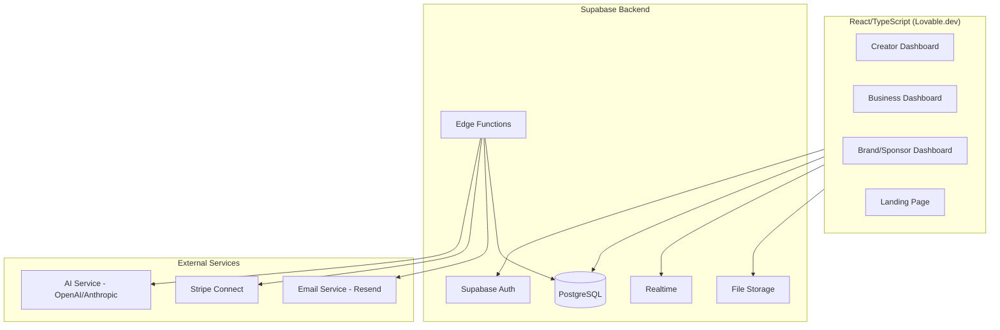

# PRD — DragonCandy

## 1. Overview

### Product Summary

DragonCandy is an AI-powered three-sided marketplace that connects content creators, restaurants, and brand sponsors. A restaurant describes what it needs, AI generates a creative brief and matches the perfect local creator, the creator shoots and delivers content within 24 hours, and the brand sponsor funding the campaign sees real-time ROI. The platform handles everything from brief generation to payment processing.

### Objective

This PRD covers the MVP as defined in product-vision.md § Product Strategy. The scope includes: AI creative brief generation, smart creator matching, creator gig flow, business approval flow, marketplace payments via Stripe Connect, campaign dashboards for all three user types, real-time analytics, and in-app messaging. The MVP targets one city with 50 creators and 10 businesses within 90 days.

### Market Differentiation

The technical implementation must deliver three things competitors can't: (1) AI that automates the brief-to-delivery pipeline so businesses don't have to manage creators manually, (2) sub-24-hour content delivery enabled by smart matching and streamlined upload flows, and (3) transparent, real-time analytics across all three marketplace sides. The system architecture must support these as first-class capabilities, not bolted-on features.

### Magic Moment

The business magic moment — type a sentence, get a complete creative brief, have a matched creator deliver content by tomorrow — requires three technical feats: AI brief generation that responds in under 30 seconds, matching that surfaces relevant local creators in under 5 seconds, and a notification + upload flow that keeps the delivery loop under 24 hours.

### Success Criteria

Time from business sign-up to first campaign creation: under 10 minutes. AI brief generation: under 30 seconds. Creator matching: under 5 seconds. Page load (LCP): under 2 seconds. Time to interactive: under 3 seconds. API response (p95): under 200ms. Payment processing: creator payout within 48 hours of approval. All P0 features functional with error handling.

---

## 2. Technical Architecture

### Architecture Overview



### Chosen Stack

| Layer | Choice | Rationale |
|-------|--------|-----------|
| Frontend | React/TypeScript (Lovable.dev) | Already built and deployed with GitHub integration. Rich ecosystem for interactive marketplace UI. |
| Backend | Supabase | Already in production with 35+ tables. Provides auth, real-time, storage, and edge functions. |
| Database | PostgreSQL (Supabase) | Already in production. Handles complex relational data across the three-sided marketplace. |
| Auth | Supabase Auth | Already integrated. Email/password and social login with role-based access control. |
| Payments | Stripe Connect | Already integrated in test mode. Marketplace payments with platform fee collection and creator payouts. |

### Stack Integration Guide

**Setup order:**
1. Supabase project (already exists) — ensure environment variables are set for `SUPABASE_URL`, `SUPABASE_ANON_KEY`, `SUPABASE_SERVICE_ROLE_KEY`
2. Stripe Connect — ensure `STRIPE_SECRET_KEY`, `STRIPE_PUBLISHABLE_KEY`, `STRIPE_WEBHOOK_SECRET` are configured. Enable Connect in Stripe dashboard.
3. AI service — set `OPENAI_API_KEY` or `ANTHROPIC_API_KEY` for brief generation and matching intelligence
4. Email service — set `RESEND_API_KEY` for transactional emails and notifications

**Integration patterns:**
Frontend communicates with Supabase directly via the JavaScript client for CRUD, auth, and real-time subscriptions. Supabase Edge Functions handle server-side logic: AI API calls, Stripe webhooks, complex business logic (matching algorithm, payment distribution). Row Level Security (RLS) policies on every table enforce role-based access.

**Common gotchas:**
RLS policies must be tested for all three user roles (creator, business, brand). Supabase Realtime subscriptions require RLS policies that allow SELECT for the subscribing user. Stripe Connect requires each creator to complete onboarding (identity verification) before receiving payouts. Edge Functions have a 60-second execution timeout — AI calls must be optimized or handled asynchronously for longer operations.

**Required environment variables:**

```
SUPABASE_URL=
SUPABASE_ANON_KEY=
SUPABASE_SERVICE_ROLE_KEY=
STRIPE_SECRET_KEY=
STRIPE_PUBLISHABLE_KEY=
STRIPE_WEBHOOK_SECRET=
OPENAI_API_KEY=
RESEND_API_KEY=
```

### Repository Structure

```
dragoncandy/
├── src/
│   ├── components/
│   │   ├── ui/                    # Design system primitives (Button, Card, Input, Modal)
│   │   ├── layout/                # Layout components (Sidebar, Header, PageContainer)
│   │   ├── creator/               # Creator-specific components
│   │   ├── business/              # Business-specific components
│   │   ├── brand/                 # Brand/sponsor-specific components
│   │   ├── campaign/              # Shared campaign components
│   │   ├── messaging/             # Chat/messaging components
│   │   └── ai/                    # AI-related components (BriefGenerator, MatchDisplay)
│   ├── pages/                     # Route pages
│   │   ├── landing/               # Public landing page
│   │   ├── auth/                  # Login, signup, onboarding flows
│   │   ├── creator/               # Creator dashboard, gigs, earnings, profile
│   │   ├── business/              # Business dashboard, campaigns, content library
│   │   ├── brand/                 # Brand dashboard, sponsored campaigns, analytics
│   │   └── admin/                 # Admin moderation tools
│   ├── lib/
│   │   ├── supabase.ts            # Supabase client initialization
│   │   ├── stripe.ts              # Stripe client helpers
│   │   ├── ai.ts                  # AI service helpers
│   │   └── utils.ts               # Shared utilities
│   ├── hooks/                     # Custom React hooks
│   ├── types/                     # TypeScript type definitions
│   └── styles/                    # Global styles, design tokens
├── supabase/
│   ├── migrations/                # Database migration files
│   └── functions/                 # Edge Functions
│       ├── generate-brief/        # AI brief generation
│       ├── match-creators/        # Creator matching algorithm
│       ├── process-payment/       # Stripe payment handling
│       ├── stripe-webhook/        # Stripe webhook handler
│       └── send-notification/     # Email/push notification sender
├── public/                        # Static assets, images
├── docs/                          # PLAID-generated documents
└── CLAUDE.md                      # Development conventions
```

### Infrastructure & Deployment

**Frontend:** Deployed via Lovable.dev with automatic GitHub sync. Every push to `main` triggers a new deployment. Preview deployments for PRs.

**Backend:** Supabase Cloud (already provisioned). Edge Functions deploy via `supabase functions deploy`. Database migrations via `supabase db push` or `supabase migration up`.

**CI/CD:** GitHub Actions for build verification on every PR. Run `npm run build` and `tsc --noEmit` before merging. Lovable.dev handles production deployment.

**Environment:** Use Supabase project settings for environment variables. Stripe keys in Supabase Edge Function secrets. Frontend environment variables via Lovable.dev's env config.

### Security Considerations

**Authentication:** Supabase Auth handles all auth flows. JWT tokens in Authorization headers. Tokens expire after 1 hour with automatic refresh.

**Row Level Security (RLS):** Every table has RLS policies. Creators see only their own gigs, earnings, and messages. Businesses see only their own campaigns and content. Brands see only their sponsored campaigns. Admin role bypasses RLS for moderation.

**API security:** Edge Functions validate auth tokens before processing. Rate limiting on auth endpoints (10 attempts per minute). Input validation with Zod schemas on all Edge Function inputs.

**File uploads:** Supabase Storage with signed URLs. Maximum file size: 100MB for videos, 10MB for images. Allowed types: mp4, mov, jpg, png, webp. Files scanned for basic validation on upload.

**Payment security:** All payment processing through Stripe — no credit card data touches DragonCandy servers. Stripe webhook signatures validated on every event.

### Cost Estimate

Monthly costs at low scale (under 1,000 users, first 6 months):

| Service | Tier | Monthly Cost |
|---------|------|-------------|
| Supabase | Pro plan | $25 |
| Stripe Connect | Pay-as-you-go | 2.9% + $0.30/transaction |
| AI API (OpenAI) | Pay-as-you-go | ~$50 (est. 1,000 brief generations) |
| Lovable.dev | Current plan | $0–20 |
| Resend (email) | Free tier | $0 (up to 3,000 emails/month) |
| Domain | Annual | ~$1/month |
| **Total** | | **~$100/month + Stripe fees** |

---

## 3. Data Model

### Entity Definitions

```sql
-- User profiles (extends Supabase Auth users)
CREATE TABLE profiles (
    id UUID PRIMARY KEY REFERENCES auth.users(id) ON DELETE CASCADE,
    email VARCHAR(255) NOT NULL,
    full_name VARCHAR(255) NOT NULL,
    avatar_url TEXT,
    role VARCHAR(20) NOT NULL CHECK (role IN ('creator', 'business', 'brand', 'admin')),
    onboarding_completed BOOLEAN DEFAULT FALSE,
    created_at TIMESTAMPTZ DEFAULT NOW(),
    updated_at TIMESTAMPTZ DEFAULT NOW()
);

-- Creator-specific profile data
CREATE TABLE creator_profiles (
    id UUID PRIMARY KEY DEFAULT gen_random_uuid(),
    user_id UUID NOT NULL REFERENCES profiles(id) ON DELETE CASCADE,
    bio TEXT,
    portfolio_urls TEXT[],
    content_styles TEXT[],         -- e.g. ['food-photography', 'video-reels', 'lifestyle']
    location_city VARCHAR(100),
    location_lat DECIMAL(10, 8),
    location_lng DECIMAL(11, 8),
    location_radius_km INTEGER DEFAULT 25,
    availability_status VARCHAR(20) DEFAULT 'available' CHECK (availability_status IN ('available', 'busy', 'unavailable')),
    stripe_connect_id VARCHAR(255),
    stripe_onboarding_complete BOOLEAN DEFAULT FALSE,
    rating_avg DECIMAL(3, 2) DEFAULT 0,
    rating_count INTEGER DEFAULT 0,
    total_earnings_cents INTEGER DEFAULT 0,
    gigs_completed INTEGER DEFAULT 0,
    created_at TIMESTAMPTZ DEFAULT NOW(),
    updated_at TIMESTAMPTZ DEFAULT NOW()
);

-- Business-specific profile data
CREATE TABLE business_profiles (
    id UUID PRIMARY KEY DEFAULT gen_random_uuid(),
    user_id UUID NOT NULL REFERENCES profiles(id) ON DELETE CASCADE,
    business_name VARCHAR(255) NOT NULL,
    business_type VARCHAR(50),     -- e.g. 'restaurant', 'cafe', 'food-truck'
    description TEXT,
    address TEXT,
    city VARCHAR(100),
    lat DECIMAL(10, 8),
    lng DECIMAL(11, 8),
    phone VARCHAR(20),
    website_url TEXT,
    instagram_handle VARCHAR(100),
    tiktok_handle VARCHAR(100),
    logo_url TEXT,
    created_at TIMESTAMPTZ DEFAULT NOW(),
    updated_at TIMESTAMPTZ DEFAULT NOW()
);

-- Brand/sponsor-specific profile data
CREATE TABLE brand_profiles (
    id UUID PRIMARY KEY DEFAULT gen_random_uuid(),
    user_id UUID NOT NULL REFERENCES profiles(id) ON DELETE CASCADE,
    brand_name VARCHAR(255) NOT NULL,
    industry VARCHAR(100),
    description TEXT,
    logo_url TEXT,
    website_url TEXT,
    contact_email VARCHAR(255),
    monthly_budget_cents INTEGER,
    created_at TIMESTAMPTZ DEFAULT NOW(),
    updated_at TIMESTAMPTZ DEFAULT NOW()
);

-- Campaigns
CREATE TABLE campaigns (
    id UUID PRIMARY KEY DEFAULT gen_random_uuid(),
    business_id UUID NOT NULL REFERENCES business_profiles(id),
    brand_id UUID REFERENCES brand_profiles(id),  -- NULL if not sponsored
    title VARCHAR(255) NOT NULL,
    description TEXT NOT NULL,
    status VARCHAR(20) DEFAULT 'draft' CHECK (status IN ('draft', 'brief_generated', 'matching', 'matched', 'in_progress', 'content_submitted', 'approved', 'completed', 'cancelled')),
    budget_cents INTEGER NOT NULL,
    platform_fee_cents INTEGER DEFAULT 0,
    brand_contribution_cents INTEGER DEFAULT 0,
    content_type VARCHAR(50),      -- e.g. 'photo', 'video-reel', 'story', 'mixed'
    target_platforms TEXT[],        -- e.g. ['instagram', 'tiktok']
    deadline TIMESTAMPTZ,
    created_at TIMESTAMPTZ DEFAULT NOW(),
    updated_at TIMESTAMPTZ DEFAULT NOW()
);

-- AI-generated creative briefs
CREATE TABLE creative_briefs (
    id UUID PRIMARY KEY DEFAULT gen_random_uuid(),
    campaign_id UUID NOT NULL REFERENCES campaigns(id) ON DELETE CASCADE,
    raw_input TEXT NOT NULL,        -- What the business typed
    generated_brief JSONB NOT NULL, -- AI-generated brief content
    content_ideas TEXT[],
    suggested_hashtags TEXT[],
    suggested_captions TEXT[],
    posting_schedule JSONB,
    style_direction TEXT,
    approved_by_business BOOLEAN DEFAULT FALSE,
    created_at TIMESTAMPTZ DEFAULT NOW(),
    updated_at TIMESTAMPTZ DEFAULT NOW()
);

-- Creator-campaign assignments (gigs)
CREATE TABLE gig_assignments (
    id UUID PRIMARY KEY DEFAULT gen_random_uuid(),
    campaign_id UUID NOT NULL REFERENCES campaigns(id),
    creator_id UUID NOT NULL REFERENCES creator_profiles(id),
    status VARCHAR(20) DEFAULT 'pending' CHECK (status IN ('pending', 'accepted', 'declined', 'in_progress', 'content_uploaded', 'approved', 'revision_requested', 'completed', 'cancelled')),
    match_score DECIMAL(5, 2),     -- AI match confidence score
    creator_payout_cents INTEGER NOT NULL,
    accepted_at TIMESTAMPTZ,
    content_uploaded_at TIMESTAMPTZ,
    approved_at TIMESTAMPTZ,
    paid_at TIMESTAMPTZ,
    created_at TIMESTAMPTZ DEFAULT NOW(),
    updated_at TIMESTAMPTZ DEFAULT NOW(),
    UNIQUE(campaign_id, creator_id)
);

-- Uploaded content deliverables
CREATE TABLE content_deliverables (
    id UUID PRIMARY KEY DEFAULT gen_random_uuid(),
    gig_id UUID NOT NULL REFERENCES gig_assignments(id) ON DELETE CASCADE,
    file_url TEXT NOT NULL,
    file_type VARCHAR(20) NOT NULL CHECK (file_type IN ('image', 'video')),
    file_size_bytes INTEGER,
    thumbnail_url TEXT,
    caption TEXT,
    hashtags TEXT[],
    ai_quality_score DECIMAL(3, 2), -- AI-assessed quality 0-1
    status VARCHAR(20) DEFAULT 'pending' CHECK (status IN ('pending', 'approved', 'rejected', 'revision_requested')),
    revision_notes TEXT,
    created_at TIMESTAMPTZ DEFAULT NOW()
);

-- Payments tracking
CREATE TABLE payments (
    id UUID PRIMARY KEY DEFAULT gen_random_uuid(),
    campaign_id UUID NOT NULL REFERENCES campaigns(id),
    gig_id UUID REFERENCES gig_assignments(id),
    payer_type VARCHAR(20) NOT NULL CHECK (payer_type IN ('business', 'brand')),
    payer_profile_id UUID NOT NULL,
    recipient_type VARCHAR(20) NOT NULL CHECK (recipient_type IN ('creator', 'platform')),
    recipient_profile_id UUID,
    amount_cents INTEGER NOT NULL,
    platform_fee_cents INTEGER DEFAULT 0,
    stripe_payment_intent_id VARCHAR(255),
    stripe_transfer_id VARCHAR(255),
    status VARCHAR(20) DEFAULT 'pending' CHECK (status IN ('pending', 'processing', 'completed', 'failed', 'refunded')),
    created_at TIMESTAMPTZ DEFAULT NOW(),
    updated_at TIMESTAMPTZ DEFAULT NOW()
);

-- In-app messages
CREATE TABLE messages (
    id UUID PRIMARY KEY DEFAULT gen_random_uuid(),
    conversation_id UUID NOT NULL,
    sender_id UUID NOT NULL REFERENCES profiles(id),
    content TEXT NOT NULL,
    read_at TIMESTAMPTZ,
    created_at TIMESTAMPTZ DEFAULT NOW()
);

-- Message conversations
CREATE TABLE conversations (
    id UUID PRIMARY KEY DEFAULT gen_random_uuid(),
    campaign_id UUID REFERENCES campaigns(id),
    participant_ids UUID[] NOT NULL,
    last_message_at TIMESTAMPTZ,
    created_at TIMESTAMPTZ DEFAULT NOW()
);

-- Reviews and ratings
CREATE TABLE reviews (
    id UUID PRIMARY KEY DEFAULT gen_random_uuid(),
    gig_id UUID NOT NULL REFERENCES gig_assignments(id),
    reviewer_id UUID NOT NULL REFERENCES profiles(id),
    reviewee_id UUID NOT NULL REFERENCES profiles(id),
    rating INTEGER NOT NULL CHECK (rating >= 1 AND rating <= 5),
    comment TEXT,
    created_at TIMESTAMPTZ DEFAULT NOW()
);

-- Campaign analytics events
CREATE TABLE campaign_analytics (
    id UUID PRIMARY KEY DEFAULT gen_random_uuid(),
    campaign_id UUID NOT NULL REFERENCES campaigns(id),
    event_type VARCHAR(50) NOT NULL, -- 'impression', 'engagement', 'click', 'share'
    event_data JSONB,
    recorded_at TIMESTAMPTZ DEFAULT NOW()
);

-- Notifications
CREATE TABLE notifications (
    id UUID PRIMARY KEY DEFAULT gen_random_uuid(),
    user_id UUID NOT NULL REFERENCES profiles(id),
    type VARCHAR(50) NOT NULL,     -- 'gig_matched', 'content_approved', 'payment_received', etc.
    title VARCHAR(255) NOT NULL,
    body TEXT,
    data JSONB,                    -- Contextual data (campaign_id, gig_id, etc.)
    read BOOLEAN DEFAULT FALSE,
    created_at TIMESTAMPTZ DEFAULT NOW()
);
```

### Relationships

**profiles ← creator_profiles / business_profiles / brand_profiles:** 1:1 relationship. Each profile has exactly one role-specific sub-profile. Linked via `user_id` foreign key. Cascade delete.

**business_profiles → campaigns:** 1:many. A business creates many campaigns. `business_id` on campaigns.

**brand_profiles → campaigns:** 1:many (optional). A brand can sponsor many campaigns. `brand_id` on campaigns (nullable).

**campaigns → creative_briefs:** 1:1. Each campaign has one AI-generated brief. `campaign_id` on creative_briefs. Cascade delete.

**campaigns → gig_assignments:** 1:many. A campaign can have multiple creator assignments (though typically 1). `campaign_id` on gig_assignments.

**creator_profiles → gig_assignments:** 1:many. A creator has many gig assignments across campaigns. `creator_id` on gig_assignments.

**gig_assignments → content_deliverables:** 1:many. A gig produces multiple content deliverables. `gig_id` on content_deliverables. Cascade delete.

**campaigns → payments:** 1:many. A campaign generates multiple payment records. `campaign_id` on payments.

**campaigns → conversations:** 1:many. A campaign can have associated conversations. `campaign_id` on conversations.

**profiles → messages:** 1:many. A user sends many messages. `sender_id` on messages.

### Indexes

```sql
-- Performance-critical queries
CREATE INDEX idx_creator_profiles_city ON creator_profiles(location_city);
CREATE INDEX idx_creator_profiles_availability ON creator_profiles(availability_status);
CREATE INDEX idx_creator_profiles_user_id ON creator_profiles(user_id);
CREATE INDEX idx_business_profiles_user_id ON business_profiles(user_id);
CREATE INDEX idx_brand_profiles_user_id ON brand_profiles(user_id);
CREATE INDEX idx_campaigns_business_id ON campaigns(business_id);
CREATE INDEX idx_campaigns_brand_id ON campaigns(brand_id);
CREATE INDEX idx_campaigns_status ON campaigns(status);
CREATE INDEX idx_gig_assignments_creator_id ON gig_assignments(creator_id);
CREATE INDEX idx_gig_assignments_campaign_id ON gig_assignments(campaign_id);
CREATE INDEX idx_gig_assignments_status ON gig_assignments(status);
CREATE INDEX idx_content_deliverables_gig_id ON content_deliverables(gig_id);
CREATE INDEX idx_payments_campaign_id ON payments(campaign_id);
CREATE INDEX idx_payments_status ON payments(status);
CREATE INDEX idx_messages_conversation_id ON messages(conversation_id);
CREATE INDEX idx_messages_created_at ON messages(created_at);
CREATE INDEX idx_notifications_user_id ON notifications(user_id);
CREATE INDEX idx_notifications_read ON notifications(user_id, read);
CREATE INDEX idx_campaign_analytics_campaign_id ON campaign_analytics(campaign_id);
```

---

## 4. API Specification

### API Design Philosophy

Supabase's JavaScript client handles direct CRUD via PostgREST (auto-generated REST API from the PostgreSQL schema). Complex business logic runs in Supabase Edge Functions (Deno-based serverless functions). Real-time updates use Supabase Realtime subscriptions.

**Error response format:**
```json
{
  "error": "Human-readable error message",
  "code": "ERROR_CODE",
  "details": {}
}
```

**Pagination:** Cursor-based using `created_at` timestamp + `id` for deterministic ordering. Default page size: 20. Max: 100.

### Endpoints

**Edge Functions (server-side logic):**

```
POST /functions/v1/generate-brief
Auth: Required (Bearer token)
Body: { campaignId: string, rawInput: string }
Response 200: {
  briefId: string,
  contentIdeas: string[],
  suggestedHashtags: string[],
  suggestedCaptions: string[],
  postingSchedule: { platform: string, bestTimes: string[] }[],
  styleDirection: string
}
Response 400: { error: string }
Response 401: { error: "Unauthorized" }
Notes: Calls AI API (OpenAI/Anthropic) to generate brief from natural language input. Max 30 seconds execution time.

POST /functions/v1/match-creators
Auth: Required (Bearer token)
Body: { campaignId: string, maxResults?: number }
Response 200: {
  matches: {
    creatorId: string,
    matchScore: number,
    profile: CreatorProfile,
    reasons: string[]
  }[]
}
Notes: Scores creators based on location proximity, content style match, availability, rating, and past performance. Returns top 5 by default.

POST /functions/v1/process-payment
Auth: Required (Bearer token)
Body: { gigId: string, action: 'charge' | 'payout' }
Response 200: { paymentId: string, status: string, stripePaymentIntentId?: string }
Notes: For 'charge' — creates Stripe PaymentIntent for the campaign budget. For 'payout' — initiates Stripe Transfer to creator's Connect account.

POST /functions/v1/stripe-webhook
Auth: Stripe webhook signature verification
Body: Stripe Event object
Response 200: { received: true }
Notes: Handles payment_intent.succeeded, transfer.created, account.updated events. Updates payment records and triggers notifications.

POST /functions/v1/send-notification
Auth: Required (service role)
Body: { userId: string, type: string, title: string, body: string, data?: object }
Response 200: { notificationId: string }
Notes: Creates in-app notification record and sends email via Resend if user has email notifications enabled.
```

**Client-side Supabase operations (via JS client):**

```typescript
// Campaigns CRUD
supabase.from('campaigns').select('*, creative_briefs(*), gig_assignments(*, creator:creator_profiles(*, profile:profiles(*)))').eq('business_id', businessId)
supabase.from('campaigns').insert({ business_id, title, description, budget_cents, content_type, target_platforms })
supabase.from('campaigns').update({ status }).eq('id', campaignId)

// Gig assignments
supabase.from('gig_assignments').select('*, campaign:campaigns(*, business:business_profiles(*), brief:creative_briefs(*))').eq('creator_id', creatorId)
supabase.from('gig_assignments').update({ status: 'accepted', accepted_at: new Date().toISOString() }).eq('id', gigId)

// Content upload
supabase.storage.from('content').upload(filePath, file)
supabase.from('content_deliverables').insert({ gig_id, file_url, file_type, caption, hashtags })

// Messages (real-time)
supabase.from('messages').insert({ conversation_id, sender_id, content })
supabase.channel('messages').on('postgres_changes', { event: 'INSERT', schema: 'public', table: 'messages', filter: `conversation_id=eq.${conversationId}` }, handleNewMessage).subscribe()

// Notifications (real-time)
supabase.channel('notifications').on('postgres_changes', { event: 'INSERT', schema: 'public', table: 'notifications', filter: `user_id=eq.${userId}` }, handleNewNotification).subscribe()

// Analytics
supabase.from('campaign_analytics').select('*').eq('campaign_id', campaignId)
supabase.rpc('get_campaign_stats', { campaign_id: campaignId }) // Custom PostgreSQL function for aggregated stats
```

---

## 5. User Stories

### Epic: Onboarding

**US-001: Creator Signup**
As Marcus (creator), I want to sign up, create my profile with portfolio pieces, set my location and content styles, so that I can start receiving matched gigs.

Acceptance Criteria:
- [ ] Given I'm on the landing page, when I click "Start Earning," then I see the creator signup flow
- [ ] Given I'm signing up, when I complete all required fields (name, email, password, location, 3+ portfolio pieces), then my account is created with role "creator"
- [ ] Given I've uploaded my portfolio, when I select my content styles, then my creator_profile is created with these preferences
- [ ] Edge case: If upload fails, show retry option with the specific file that failed

**US-002: Business Signup**
As Sofia (restaurant owner), I want to sign up, add my restaurant details, so that I can start creating campaigns for content.

Acceptance Criteria:
- [ ] Given I'm on the landing page, when I click "Get Content," then I see the business signup flow
- [ ] Given I'm signing up, when I complete required fields (name, email, password, business name, address), then my account is created with role "business"
- [ ] Edge case: If address geocoding fails, allow manual lat/lng entry or skip with a note

**US-003: Brand Signup**
As James (brand marketing director), I want to sign up with my brand details and budget, so that I can sponsor content campaigns.

Acceptance Criteria:
- [ ] Given I'm on the landing page, when I click "Sponsor Campaigns," then I see the brand signup flow
- [ ] Given I'm signing up, when I complete required fields (name, email, password, brand name, industry), then my account is created with role "brand"

### Epic: Campaign Creation

**US-004: AI Brief Generation**
As Sofia, I want to describe what I need in plain language and have AI generate a complete creative brief, so that I don't have to write one from scratch.

Acceptance Criteria:
- [ ] Given I'm on my dashboard, when I tap "New Campaign" and type a description, then AI generates a brief within 30 seconds
- [ ] Given the brief is generated, when I review it, then I see content ideas, hashtags, captions, and a posting schedule
- [ ] Given I see the brief, when I tap "Approve Brief," then the campaign moves to matching status
- [ ] Edge case: If AI generation fails, show "Let's try again" with retry button. After 2 failures, offer manual brief template.

**US-005: Smart Creator Matching**
As the platform, I want to automatically match the best creators to a campaign based on location, style, availability, and rating, so that businesses get relevant matches without searching.

Acceptance Criteria:
- [ ] Given a campaign brief is approved, when matching runs, then top 3–5 creators are notified within 5 seconds
- [ ] Given creators are matched, when a creator opens the notification, then they see the brief, location, pay, and deadline
- [ ] Edge case: If fewer than 3 creators match, widen the location radius by 10km and re-match

### Epic: Content Delivery

**US-006: Creator Accepts and Delivers Gig**
As Marcus, I want to accept a matched gig, upload my content, and get paid quickly, so that I earn money doing what I love.

Acceptance Criteria:
- [ ] Given I receive a gig notification, when I tap "Accept," then the gig status changes and the business is notified
- [ ] Given I've shot content, when I upload files (photo/video) with caption and hashtags, then the content appears in the business's review queue
- [ ] Given the business approves, when approval happens, then my wallet shows the pending payment amount
- [ ] Edge case: If upload exceeds 100MB, show a clear error with file size limit

**US-007: Business Approves Content**
As Sofia, I want to preview delivered content and approve it with one tap, so that I can get back to running my restaurant.

Acceptance Criteria:
- [ ] Given a creator uploads content, when I receive a notification and open it, then I see the content preview (photo/video), caption, and hashtags
- [ ] Given I see the content, when I tap "Approve," then the content is marked approved and the creator payment process begins
- [ ] Given I see the content, when I tap "Request Changes," then I can type a note and the creator is notified
- [ ] Edge case: If I don't respond within 48 hours, send a reminder notification

### Epic: Payments

**US-008: Creator Gets Paid**
As Marcus, I want to receive payment within 48 hours of content approval, so that I have reliable, fast income.

Acceptance Criteria:
- [ ] Given content is approved, when payment processes, then the creator payout amount (campaign budget minus platform fee) is transferred via Stripe Connect
- [ ] Given the transfer completes, when I check my earnings dashboard, then I see the payment with campaign details and timestamp
- [ ] Edge case: If Stripe transfer fails, retry once and notify admin if retry fails

### Epic: Analytics & Dashboard

**US-009: Campaign Dashboard**
As any user type, I want to see my relevant campaign information at a glance, so that I always know what's happening.

Acceptance Criteria:
- [ ] Given I'm a creator, when I open my dashboard, then I see: active gigs, pending gigs, recent earnings, total earnings, and my rating
- [ ] Given I'm a business, when I open my dashboard, then I see: active campaigns, content awaiting approval, past campaigns with content, and total spend
- [ ] Given I'm a brand, when I open my dashboard, then I see: sponsored campaigns, total spend, content produced, and aggregate analytics

**US-010: Real-Time Analytics**
As James (brand), I want to see real-time metrics on my sponsored campaigns, so that I can track ROI.

Acceptance Criteria:
- [ ] Given a campaign has content posted, when I view campaign analytics, then I see impressions, engagement rate, and content performance
- [ ] Given analytics update, when new data arrives, then the dashboard refreshes in real-time without page reload

### Epic: Messaging

**US-011: In-App Messaging**
As Marcus and Sofia, we want to message each other within the app to coordinate gig logistics, so that we don't need to exchange phone numbers.

Acceptance Criteria:
- [ ] Given I'm assigned to a gig, when I open the gig detail, then I see a message thread with the business
- [ ] Given I type a message, when I hit send, then the other party sees it in real-time
- [ ] Edge case: Messages are scoped to campaign conversations — no unsolicited messaging

---

## 6. Functional Requirements

**FR-001: Role-Based Authentication**
Priority: P0
Description: Users sign up with email/password, selecting their role (creator, business, or brand). Each role sees a different onboarding flow and dashboard. Role is set at signup and stored in the profiles table.
Acceptance Criteria: Users can sign up, log in, and are routed to role-specific dashboards. Password reset works via email.
Related Stories: US-001, US-002, US-003

**FR-002: Creator Profile Management**
Priority: P0
Description: Creators create and edit their profile: bio, portfolio (upload up to 10 images/videos), content styles (multi-select from predefined list), location (auto-detect or manual), availability status toggle.
Acceptance Criteria: Profile data saves correctly, portfolio files upload to Supabase Storage, location geocodes correctly, availability reflects in matching.
Related Stories: US-001

**FR-003: Business Profile Management**
Priority: P0
Description: Businesses create and edit their profile: business name, type, address (geocoded), phone, social media handles, logo upload.
Acceptance Criteria: Profile data saves correctly, address geocodes to lat/lng for location matching, logo uploads to Storage.
Related Stories: US-002

**FR-004: AI Creative Brief Generation**
Priority: P0
Description: Business types a plain-language description (minimum 10 characters). Edge Function calls AI API to generate a structured brief with content ideas, hashtags, captions, posting schedule, and style direction. Brief is saved to creative_briefs table and displayed for business review.
Acceptance Criteria: Brief generates in under 30 seconds, contains all structured fields, saves to database, and business can approve or edit.
Related Stories: US-004

**FR-005: Smart Creator Matching**
Priority: P0
Description: When a brief is approved, Edge Function scores available creators based on: location proximity (within their set radius), content style overlap, availability status, rating, and past gig completion rate. Top 3–5 matches are sent gig invitations.
Acceptance Criteria: Matching runs in under 5 seconds, returns scored results, creators are notified of new gig opportunities.
Related Stories: US-005

**FR-006: Gig Acceptance Flow**
Priority: P0
Description: Creator sees pending gig with brief details, location, pay amount, and deadline. One tap to accept. Acceptance updates gig_assignment status and notifies the business.
Acceptance Criteria: Gig details display correctly, accept action is one tap, status updates in real-time, business gets notified.
Related Stories: US-006

**FR-007: Content Upload and Delivery**
Priority: P0
Description: Creator uploads content files (images and/or videos) with caption and hashtags. Files upload to Supabase Storage. Content deliverables are created and linked to the gig. Business is notified of new content awaiting approval.
Acceptance Criteria: Files upload with progress indicator, file type and size validation, deliverables save correctly, business notification triggers.
Related Stories: US-006

**FR-008: One-Tap Content Approval**
Priority: P0
Description: Business previews uploaded content (photo/video player, caption, hashtags). "Approve" button approves the content and triggers payment. "Request Changes" allows a text note sent back to creator.
Acceptance Criteria: Content previews correctly (video plays, images display), approve triggers payment flow, revision notes sent to creator.
Related Stories: US-007

**FR-009: Marketplace Payments**
Priority: P0
Description: Campaign payment flow: business is charged the campaign budget via Stripe PaymentIntent. Upon content approval, platform fee (15%) is retained and the remainder is transferred to the creator's Stripe Connect account. Creator sees earnings in their dashboard.
Acceptance Criteria: Payment charges correctly, platform fee calculated correctly, creator payout transfers within 48 hours, all transactions logged in payments table.
Related Stories: US-008

**FR-010: Creator Dashboard**
Priority: P0
Description: Creator sees: available gigs (matched but not accepted), active gigs (accepted, in progress), earnings summary (this week, this month, all time), recent payments, rating, and profile completion status.
Acceptance Criteria: Dashboard loads under 2 seconds, data is accurate and real-time, gig cards show all relevant info.
Related Stories: US-009

**FR-011: Business Dashboard**
Priority: P0
Description: Business sees: active campaigns and their status, content awaiting approval, past campaigns with content library, spending summary.
Acceptance Criteria: Dashboard loads under 2 seconds, campaign cards show current status, content preview available inline.
Related Stories: US-009

**FR-012: In-App Messaging**
Priority: P0
Description: Real-time messaging between creators and businesses within campaign context. Messages use Supabase Realtime subscriptions. Conversations are scoped to campaigns.
Acceptance Criteria: Messages send and display in real-time, conversation history persists, unread count badges display.
Related Stories: US-011

**FR-013: Notifications System**
Priority: P1
Description: In-app notification bell with count badge. Notification types: gig matched, gig accepted, content uploaded, content approved, payment received, new message, revision requested. Email notifications for critical events (payment, new gig match).
Acceptance Criteria: Notifications appear in real-time, clicking a notification navigates to relevant screen, email sends for configured events.

**FR-014: Brand Campaign Sponsorship**
Priority: P1
Description: Brands create sponsored campaigns targeting specific restaurants or restaurant types. Brand budget supplements the business's campaign budget. Brand messaging is included in the AI brief generation. Brand sees analytics for their sponsored campaigns.
Acceptance Criteria: Brand can create campaigns with target restaurants, budget allocates correctly between brand and platform, brief includes brand messaging.

**FR-015: Creator Ratings and Reviews**
Priority: P1
Description: After a gig completes, businesses rate creators (1–5 stars with optional comment). Ratings affect creator's average rating and influence matching scores.
Acceptance Criteria: Rating prompt appears after gig completion, ratings calculate correctly, creator profile shows average.

**FR-016: Admin Moderation Panel**
Priority: P1
Description: Admin dashboard for platform management: review creator applications, moderate content flags, handle payment disputes, view platform-wide metrics (campaigns/week, average delivery time, total revenue).
Acceptance Criteria: Admin can approve/reject creator profiles, view all campaigns, manage disputes, see aggregate metrics.

---

## 7. Non-Functional Requirements

### Performance

Page load time (LCP): under 2 seconds on 4G connection. Time to interactive: under 3 seconds. API response (p95): under 200ms for Supabase queries, under 30 seconds for AI brief generation. Initial JavaScript bundle: under 300KB gzipped. Image/video upload: progress indicator shown, no timeout under 100MB file. Real-time message delivery: under 500ms from send to display.

### Security

All data transmitted over HTTPS/TLS 1.3. Supabase Auth JWT tokens expire after 1 hour with automatic refresh. Row Level Security (RLS) on every table — no public access without auth. Rate limiting: 10 login attempts per minute per IP, 100 API requests per minute per user. File upload validation: MIME type checking, size limits enforced server-side. Stripe webhook signature verification on every event. No storage of payment card data — Stripe handles all PCI compliance. Content Security Policy headers configured.

### Accessibility

WCAG 2.1 AA compliance. Color contrast minimum 4.5:1 for body text, 3:1 for large text. All images have alt text. All icon-only buttons have aria-labels. Keyboard navigation for all interactive elements. Focus indicators visible (2px teal outline). Touch targets minimum 44x44px. Form inputs have associated labels. Error messages linked to form fields via aria-describedby. Respect `prefers-reduced-motion`. Screen reader tested on core flows.

### Scalability

Initial target: 1,000 concurrent users on Supabase Pro plan. Database connection pooling via Supabase's built-in PgBouncer. Edge Functions scale automatically. File storage CDN-backed via Supabase Storage. Designed for horizontal scaling — no in-memory state between requests.

### Reliability

Target 99.5% uptime (Supabase SLA). Graceful degradation: if AI service is down, show manual brief template. If Stripe is down, queue payments for retry. If Realtime is down, polling fallback for messages (30-second interval). Database backups: Supabase handles daily automatic backups. Error logging and monitoring via Supabase Dashboard logs.

---

## 8. UI/UX Requirements

### Screen: Landing Page
Route: `/`
Purpose: Convert visitors into signups for one of three user types.
Layout: Full-width hero with tagline, animated content examples, three CTA cards (creators, businesses, brands), social proof section, footer.

States:
- **Populated:** Full landing page content with animated examples.
- **Loading:** Skeleton for dynamic content (e.g., featured campaigns).

Key Interactions:
- Click "Start Earning" → navigate to `/auth/signup?role=creator`
- Click "Get Content" → navigate to `/auth/signup?role=business`
- Click "Sponsor Campaigns" → navigate to `/auth/signup?role=brand`

### Screen: Creator Dashboard
Route: `/creator/dashboard`
Purpose: Creator's home — see available gigs, active work, and earnings.
Layout: Sidebar navigation (Dashboard, My Gigs, Earnings, Messages, Profile). Main content area with grid of cards.

States:
- **Empty:** "No gigs yet — make sure your portfolio has at least 5 pieces so our AI can match you."
- **Loading:** Skeleton cards pulsing in the grid.
- **Populated:** Available gigs section (matched, not yet accepted), active gigs section (in progress), earnings widget (this week / this month / all time), rating display.
- **Error:** "Something went wrong loading your dashboard. Tap to retry."

Key Interactions:
- Tap gig card → expand to show brief, location on map, pay, deadline
- Tap "Accept" on gig → status changes, business notified, gig moves to active
- Tap earnings widget → navigate to `/creator/earnings`

### Screen: Business Dashboard
Route: `/business/dashboard`
Purpose: Business owner's home — manage campaigns and approve content.
Layout: Sidebar navigation (Dashboard, Campaigns, Content Library, Messages, Profile). Main content area.

States:
- **Empty:** "Ready to get some amazing content? Tap 'New Campaign' to get started."
- **Loading:** Skeleton cards.
- **Populated:** Active campaigns with status badges, "Content to Review" section with thumbnails, recent campaigns.
- **Error:** "Something went wrong. Tap to retry."

Key Interactions:
- Tap "New Campaign" → navigate to campaign creation flow
- Tap campaign card → navigate to campaign detail
- Tap content thumbnail → open content review modal with approve/request changes

### Screen: Campaign Creation Flow
Route: `/business/campaigns/new`
Purpose: Business creates a new campaign using AI brief generation.
Layout: Single-column centered form. Step 1: text input for description. Step 2: AI brief review. Step 3: confirm and launch.

States:
- **Step 1 - Input:** Large text area with placeholder "Describe what you need — e.g., 'We just launched a spicy chicken sandwich and want people to know about it'"
- **Step 1 - Generating:** Text area disabled, teal pulsing animation, "Writing your brief..." text
- **Step 2 - Brief Review:** Generated brief displayed in cards (content ideas, hashtags, captions, schedule). "Approve" and "Edit" buttons.
- **Step 3 - Confirm:** Budget input, deadline selector, confirm button.
- **Error:** AI generation failed → "Let's try again" retry button. After 2 failures → manual template.

Key Interactions:
- Type description → tap "Generate Brief" → AI generates brief (30 seconds max)
- Review brief → tap "Approve" or edit individual fields
- Set budget and deadline → tap "Launch Campaign" → matching begins

### Screen: Content Review Modal
Route: modal overlay on business dashboard
Purpose: Business previews and approves/rejects creator content.
Layout: Full-screen modal. Left: content preview (photo viewer or video player). Right: caption, hashtags, creator info. Bottom: "Approve" (teal, prominent) and "Request Changes" (ghost) buttons.

States:
- **Loading:** Skeleton for media content.
- **Populated:** Media displays, metadata shown.
- **Approving:** Teal flash animation on tap.

Key Interactions:
- View content (swipe for multiple deliverables)
- Tap "Approve" → content approved, payment triggered, modal closes with success toast
- Tap "Request Changes" → text input for revision notes, sends to creator

### Screen: Brand Dashboard
Route: `/brand/dashboard`
Purpose: Brand sponsor's home — manage sponsored campaigns and view analytics.
Layout: Sidebar navigation (Dashboard, Campaigns, Analytics, Profile). Main content area.

States:
- **Empty:** "Ready to sponsor your first campaign? Tap 'New Campaign' to reach local restaurants."
- **Loading:** Skeleton cards.
- **Populated:** Active sponsored campaigns, spend summary, aggregate metrics (impressions, engagement, content produced).
- **Error:** "Something went wrong. Tap to retry."

### Screen: Messaging
Route: `/messages` or inline within campaign detail
Purpose: Real-time messaging between creators and businesses.
Layout: Left panel: conversation list with last message preview. Right panel: message thread with input field.

States:
- **Empty:** "No conversations yet. Start a campaign to connect with creators!"
- **Loading:** Skeleton conversation list.
- **Populated:** Conversations sorted by most recent. Active conversation shows full thread.

Key Interactions:
- Click conversation → load thread
- Type message + send → appears in real-time for both parties
- New message notification → unread badge on conversation

### Screen: Creator Profile / Portfolio
Route: `/creator/profile`
Purpose: Creator manages their profile, portfolio, and settings.
Layout: Header with avatar and name. Sections: portfolio grid, content styles, location settings, availability toggle, Stripe Connect status.

Key Interactions:
- Upload/remove portfolio pieces
- Toggle availability status
- Connect/manage Stripe account for payouts

---

## 9. Design System

> For the complete design system — color tokens (`dc-*`), typography (Outfit/Pacifico),
> button variants, card patterns, navigation, messaging UI, and design rules — see
> **`docs/DESIGN_SYSTEM.md`**. That file is the single source of truth for all visual
> design decisions and is auto-loaded into every Claude Code session via CLAUDE.md.

---

## 10. Auth Implementation

### Auth Flow

Supabase Auth handles all authentication. Users sign up with email/password, selecting their role during signup. After email verification, users are routed to their role-specific onboarding flow.

### Provider Configuration

```typescript
// src/lib/supabase.ts
import { createClient } from '@supabase/supabase-js'

const supabaseUrl = import.meta.env.VITE_SUPABASE_URL
const supabaseAnonKey = import.meta.env.VITE_SUPABASE_ANON_KEY

export const supabase = createClient(supabaseUrl, supabaseAnonKey)
```

**Signup with role metadata:**
```typescript
const { data, error } = await supabase.auth.signUp({
  email,
  password,
  options: {
    data: { role, full_name }
  }
})
```

**Database trigger creates profile on signup:**
```sql
CREATE OR REPLACE FUNCTION handle_new_user()
RETURNS TRIGGER AS $$
BEGIN
  INSERT INTO profiles (id, email, full_name, role)
  VALUES (
    NEW.id,
    NEW.email,
    NEW.raw_user_meta_data->>'full_name',
    NEW.raw_user_meta_data->>'role'
  );
  RETURN NEW;
END;
$$ LANGUAGE plpgsql SECURITY DEFINER;

CREATE TRIGGER on_auth_user_created
  AFTER INSERT ON auth.users
  FOR EACH ROW EXECUTE FUNCTION handle_new_user();
```

### Protected Routes

```typescript
// Route guard component
function ProtectedRoute({ children, allowedRoles }: { children: React.ReactNode, allowedRoles: string[] }) {
  const { user, profile, loading } = useAuth()

  if (loading) return <LoadingSkeleton />
  if (!user) return <Navigate to="/auth/login" />
  if (!allowedRoles.includes(profile.role)) return <Navigate to="/unauthorized" />

  return <>{children}</>
}
```

### User Session Management

Supabase handles session persistence via localStorage. Auto-refresh is built in. Use `supabase.auth.onAuthStateChange()` to react to session changes.

```typescript
useEffect(() => {
  const { data: { subscription } } = supabase.auth.onAuthStateChange((event, session) => {
    if (event === 'SIGNED_OUT') navigate('/auth/login')
    if (event === 'TOKEN_REFRESHED') // Session refreshed automatically
  })
  return () => subscription.unsubscribe()
}, [])
```

### Role-Based Access

Roles: `creator`, `business`, `brand`, `admin`. Stored in `profiles.role`. RLS policies check role for every query:

```sql
-- Example: Creators can only see their own gig assignments
CREATE POLICY "Creators view own gigs" ON gig_assignments
  FOR SELECT USING (
    creator_id = (SELECT id FROM creator_profiles WHERE user_id = auth.uid())
  );

-- Example: Businesses can only see their own campaigns
CREATE POLICY "Businesses view own campaigns" ON campaigns
  FOR SELECT USING (
    business_id = (SELECT id FROM business_profiles WHERE user_id = auth.uid())
  );
```

---

## 11. Payment Integration

### Payment Flow

1. Business creates campaign with budget (e.g., $200)
2. On campaign launch, Stripe PaymentIntent created for the full budget
3. Business is charged (or payment method authorized)
4. Creator delivers content, business approves
5. Platform fee calculated (15% = $30)
6. Creator payout initiated ($170) via Stripe Transfer to their Connect account
7. Creator receives funds in their bank account (Stripe's standard payout schedule, typically 2 business days)

### Provider Setup

**Stripe Connect configuration:**
Use Stripe Connect Express for creator accounts — Stripe handles identity verification, tax forms, and payout management. Creator onboards via Stripe-hosted onboarding link.

```typescript
// Create Connect account for creator
const account = await stripe.accounts.create({
  type: 'express',
  country: 'US',
  capabilities: { transfers: { requested: true } },
  metadata: { dragoncandy_creator_id: creatorId }
})

// Generate onboarding link
const accountLink = await stripe.accountLinks.create({
  account: account.id,
  refresh_url: `${baseUrl}/creator/stripe/refresh`,
  return_url: `${baseUrl}/creator/stripe/complete`,
  type: 'account_onboarding'
})
```

### Pricing Model Implementation

Platform fee: 15% of campaign budget. Calculation:
```
creator_payout = campaign_budget * 0.85
platform_fee = campaign_budget * 0.15
```

For sponsored campaigns:
```
total_budget = business_contribution + brand_contribution
creator_payout = total_budget * 0.85
platform_fee = total_budget * 0.15
```

### Webhook Handling

```typescript
// supabase/functions/stripe-webhook/index.ts
Deno.serve(async (req) => {
  const signature = req.headers.get('stripe-signature')
  const body = await req.text()
  const event = stripe.webhooks.constructEvent(body, signature, webhookSecret)

  switch (event.type) {
    case 'payment_intent.succeeded':
      // Update campaign payment status
      // Notify business of successful charge
      break
    case 'transfer.created':
      // Update creator payout status
      // Notify creator of incoming payment
      break
    case 'account.updated':
      // Update creator's stripe_onboarding_complete status
      break
  }
})
```

### Subscription Management

Not applicable for v1. DragonCandy uses per-transaction marketplace fees, not subscriptions. If subscription tiers are added later (e.g., premium business accounts), implement via Stripe Subscriptions.

---

## 12. Edge Cases & Error Handling

### Feature: AI Brief Generation
| Scenario | Expected Behavior | Priority |
|----------|-------------------|----------|
| AI API timeout (>30s) | Show "Taking longer than usual..." after 15s. Timeout at 30s with retry button. | P0 |
| AI API returns empty/invalid response | Show retry button. After 2 failures, offer manual brief template. | P0 |
| AI API rate limited | Queue request with 5-second delay, retry. Show "Brief generation is busy, trying again..." | P1 |
| Business input is too short (<10 chars) | Inline validation: "Tell us a bit more — describe your product or what you want to promote." | P0 |
| AI generates inappropriate content | Content filter on AI output. Flag for admin review if triggered. | P1 |

### Feature: Creator Matching
| Scenario | Expected Behavior | Priority |
|----------|-------------------|----------|
| No creators match (location/style) | Widen search radius by 10km increments up to 50km. If still no matches, notify business: "We're expanding our creator network in your area. We'll notify you when matches are available." | P0 |
| All matched creators decline | Re-run matching excluding declined creators. If no new matches, notify business with estimated wait time. | P0 |
| Creator accepts but becomes unavailable | Allow creator to cancel within 2 hours of acceptance. Re-match automatically. | P1 |

### Feature: Content Upload
| Scenario | Expected Behavior | Priority |
|----------|-------------------|----------|
| Upload fails mid-progress | Show retry button with the failed file. Partially uploaded files are cleaned up. | P0 |
| File exceeds size limit (100MB video, 10MB image) | Block upload with clear message: "This video is too large. Try keeping it under 100MB." | P0 |
| Unsupported file type | Block upload: "We accept JPG, PNG, MP4, and MOV files." | P0 |
| Upload during poor network | Show progress percentage. Resume support if browser supports it. Timeout after 5 minutes. | P1 |

### Feature: Payments
| Scenario | Expected Behavior | Priority |
|----------|-------------------|----------|
| Business payment method fails | Notify business via email and in-app: "Your payment didn't go through. Please update your payment method." Campaign paused until resolved. | P0 |
| Creator Stripe account not connected | Block gig acceptance until Stripe onboarding is complete. Show "Connect your bank account to start earning." | P0 |
| Stripe transfer to creator fails | Retry once automatically. If retry fails, create admin notification for manual resolution. Creator sees "Payment processing — we're working on it." | P0 |
| Dispute/chargeback | Flag for admin review. Freeze creator payout until resolved. Notify both parties. | P1 |

### Feature: Messaging
| Scenario | Expected Behavior | Priority |
|----------|-------------------|----------|
| Realtime connection drops | Fallback to polling (30-second interval). Show "Reconnecting..." indicator. Auto-reconnect when network returns. | P0 |
| Message fails to send | Show "Not sent" indicator with retry button. Messages queued locally until connection restored. | P0 |

### Feature: Authentication
| Scenario | Expected Behavior | Priority |
|----------|-------------------|----------|
| Token expires mid-session | Auto-refresh via Supabase client. If refresh fails, redirect to login with "Session expired" message. | P0 |
| Multiple tabs/devices | Supabase handles multi-tab session sync. Logout in one tab logs out all. | P1 |

---

## 13. Dependencies & Integrations

### Core Dependencies

```json
{
  "react": "latest",
  "react-dom": "latest",
  "react-router-dom": "latest",
  "@supabase/supabase-js": "latest",
  "stripe": "latest",
  "@stripe/stripe-js": "latest",
  "@stripe/react-stripe-js": "latest",
  "lucide-react": "latest",
  "react-hook-form": "latest",
  "zod": "latest",
  "@hookform/resolvers": "latest",
  "date-fns": "latest",
  "recharts": "latest",
  "framer-motion": "latest",
  "sonner": "latest",
  "clsx": "latest",
  "tailwind-merge": "latest"
}
```

### Development Dependencies

```json
{
  "typescript": "latest",
  "tailwindcss": "latest",
  "postcss": "latest",
  "autoprefixer": "latest",
  "eslint": "latest",
  "prettier": "latest"
}
```

### Third-Party Services

| Service | Purpose | Pricing | API Key Required |
|---------|---------|---------|-----------------|
| Supabase | Backend, DB, Auth, Storage, Realtime | Pro $25/mo | SUPABASE_URL, SUPABASE_ANON_KEY, SUPABASE_SERVICE_ROLE_KEY |
| Stripe Connect | Marketplace payments | 2.9% + $0.30/tx | STRIPE_SECRET_KEY, STRIPE_PUBLISHABLE_KEY |
| OpenAI API | Brief generation, matching intelligence | ~$0.05/brief | OPENAI_API_KEY |
| Resend | Transactional email | Free tier (3K/mo) | RESEND_API_KEY |

---

## 14. Out of Scope

**Mobile native apps:** Web-responsive covers v1. Native apps deferred to month 4–6 after PMF validation.

**Content auto-posting:** Social media API integrations (Instagram Graph, TikTok) are complex and fragile. Deferred to month 2–3. v1 delivers content to the business for manual posting.

**Advanced attribution:** POS integration, foot traffic correlation, and sales lift modeling require partnerships with POS providers. Deferred to month 3–4.

**Creator tier system:** Bronze/Silver/Gold tiers with differentiated rates. Premature with 50 initial creators. Deferred to month 3–4.

**Multi-city management:** City-specific pricing, local onboarding, regional dashboards. Deferred until first city is proven.

**Video editing tools:** In-app editing would be valuable but is a massive engineering effort. Creators use their own tools (CapCut, etc.).

**White-label API:** Brand embedding of DragonCandy. No demand signal yet.

---

## 15. Open Questions

**OQ-1: Which AI provider for brief generation?** Options: OpenAI (GPT-4), Anthropic (Claude). Both are capable. Recommended default: OpenAI — slightly better at creative/marketing copy. Can swap later without major refactoring since the Edge Function abstracts the provider.

**OQ-2: Creator payout frequency?** Options: per-gig (immediately on approval), daily batch, weekly batch. Recommended default: per-gig instant — aligns with the "fast payment" value prop but increases Stripe transfer volume and fees.

**OQ-3: Platform fee structure?** Options: flat 15%, tiered by volume (lower fee for high-volume businesses), split between business and creator (7.5% each). Recommended default: flat 15% from the business side — simplest to implement, transparent, and standard for marketplaces.

**OQ-4: Content licensing terms?** Who owns the content after it's approved? Options: creator retains ownership with license to business, business owns outright, shared ownership. Recommended default: creator retains ownership, grants business unlimited usage license for social media. Keeps creators happy, protects businesses.

**OQ-5: How to handle the initial chicken-and-egg problem?** The matching algorithm needs creators to function, but creators need gigs to stay. Recommended approach: seed 50 creators with guaranteed minimum earnings ($200 for first month) funded by the platform. Run 5 "showcase campaigns" with partner restaurants to generate initial content and case studies.
