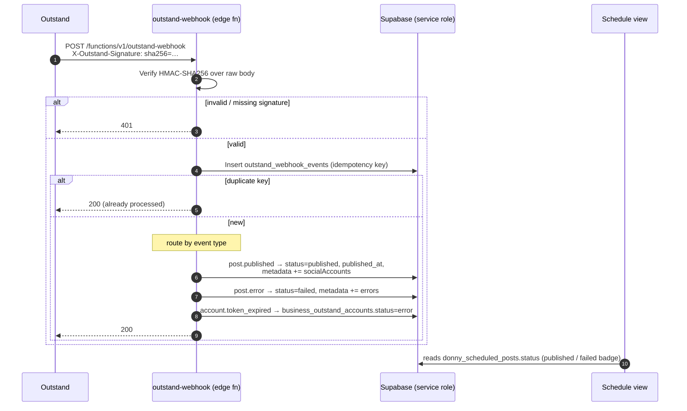

# Outstand Publish Webhook — Design Spec

> Status: Draft for review · Date: 2026-06-07 · Author: Dame + Claude

## 1. Context & Problem

DragonCandy schedules social posts through Outstand. `confirm-posting-schedule`
queues each `donny_scheduled_posts` row to Outstand (`POST /v1/posts`), stores
the returned Outstand id in `metadata.outstand_post_id`, and sets the row's
`status = 'scheduled'`. **Nothing ever advances it past `scheduled`.** There is
no Outstand webhook handler, and `outstand-reconcile` only reconciles
`business_outstand_accounts`. So `published`/`failed` and `published_at` (both
already defined on the table) are never written — rows sit at `scheduled`
indefinitely, the UI shows them as pending forever, and publish failures are
invisible.

Outstand **does** support outbound webhooks (confirmed in the account dashboard
and the public docs at `outstand.so/docs/webhooks` / `/docs/post-lifecycle`),
so we can close the lifecycle with a push handler instead of polling.

## 2. Goals / Non-Goals

**Goals**
- Transition `donny_scheduled_posts` from `scheduled` → `published` / `failed`
  in real time when Outstand publishes (or fails) a post, and populate
  `published_at`.
- Surface publish **failures** in the schedule UI.
- Proactively flag accounts whose OAuth token expired (reuse the existing
  reconnect-needed flow).

**Non-Goals**
- Polling / cron fallback (the webhook replaces the previously-considered
  `outstand-poll-posts` approach; the project's `pg_cron` + `app.settings.*` GUC
  path is flagged unreliable in prod anyway).
- DragonShare boost cross-posts — `fire-dragonshare-social-hook` does not write
  `donny_scheduled_posts`, so it is out of scope here.
- Publish **notifications** (bell/email/Donny) on publish/failure — separate
  feature; this spec only fixes status truth + failure visibility.

## 3. Background — Outstand Webhook Contract

Source: `outstand.so/docs/webhooks`, `outstand.so/docs/post-lifecycle`.

**Events we consume**
| Event | Fires when | Key payload fields |
|-------|-----------|--------------------|
| `post.published` | ≥1 target account succeeds (covers partial success) | `postId`, `orgId`, `publishedAt`, `socialAccounts[]` (`accountId`, `network`, `username`, `platformPostId`, `status`) |
| `post.error` | **all** target accounts fail | `postId`, `orgId`, `socialAccounts[]` (`accountId`, `network`, `username`, `error`) |
| `account.token_expired` | a social account's OAuth token failed to refresh | `orgId`, `accountId`, `network`, `username`, `error` |

Ignored: `import.completed`, `import.failed` (ack 200, no-op).

**Per-account status** values: `pending | published | failed`. Post-level
`publishedAt` = when the first account published. **Partial success** (some
accounts fail) still fires `post.published`, not an intermediate event — so we
map it to `published` and record the per-account results for visibility.

**Authentication**: header `X-Outstand-Signature: sha256=<hex>` where `<hex>` is
`HMAC-SHA256(rawRequestBody, signingSecret)`. The signing secret is set when the
webhook is created in Outstand → Settings → Webhooks.

**Correlation**: webhook `postId` === our stored `metadata.outstand_post_id`
(`confirm-posting-schedule` saves `outstandData.data.post.id`; `outstand-proxy`
already queries rows via `metadata->>outstand_post_id`).

## 4. Design

### 4.1 Architecture



### 4.2 New edge function — `supabase/functions/outstand-webhook/index.ts`

Pattern mirrors `stripe-webhook` and `toast-redemption-webhook`.

1. `OPTIONS` → 200.
2. Read **raw** body text (needed for signature).
3. Verify signature: compute `HMAC-SHA256(rawBody, OUTSTAND_WEBHOOK_SECRET)` via
   Web Crypto (`crypto.subtle`), hex-encode, constant-time compare to the header
   value (after stripping `sha256=`). Missing/invalid → `401`.
4. Parse JSON; extract `event` + payload.
5. Route the event (all writes via the service-role client), using **guarded
   updates** so any duplicate/out-of-order delivery is a safe no-op:
   - `post.published` → update `donny_scheduled_posts` where
     `metadata->>outstand_post_id = postId` **AND `status <> 'published'`**:
     set `status='published'`, `published_at = payload.publishedAt ?? now()`,
     merge `socialAccounts[]` into `metadata.publish_result`. 0 rows matched →
     log + `200` (foreign post, or already published).
   - `post.error` → same lookup, also guarded `status <> 'published'` (never
     downgrade a published row): `status='failed'`, merge per-account errors into
     `metadata.publish_result`.
   - `account.token_expired` → update `business_outstand_accounts` where
     `outstand_social_account_id = accountId` (expected to match **at most one**
     row): `status='error'` (the exact state `outstand-reconcile` sets, which the
     reconnect-needed UI already reads).
   - `import.*` / unknown → log + `200`.
6. **Idempotency / audit**: *after* a successful write, insert a row into
   `outstand_webhook_events` keyed `id = "<event>:<postId>"`, ignoring a
   unique-violation. Recording **after** the write (not before) ensures a
   transient write failure lets Outstand's retry succeed rather than being
   short-circuited as "already processed"; the guarded updates in step 5 make a
   genuine duplicate a no-op regardless. `account.token_expired` skips this insert
   (it is naturally idempotent).
7. Respond `200` quickly.

Signature helper may live inline or in `_shared/outstand-signature.ts` (small,
single-purpose) — decided at implementation.

### 4.3 Data model

**New table** (`supabase/migrations/<ts>_outstand_webhook_events.sql`):

```sql
create table if not exists public.outstand_webhook_events (
  id          text primary key,         -- "<event>:<postId>"
  event       text not null,
  post_id     text,
  account_id  text,
  payload     jsonb,
  received_at timestamptz not null default now()
);
alter table public.outstand_webhook_events enable row level security;
-- No policies: only the service_role (which bypasses RLS) reads/writes.

-- Speeds up the webhook's correlation lookup on donny_scheduled_posts.
create index if not exists idx_dsp_outstand_post_id
  on public.donny_scheduled_posts ((metadata->>'outstand_post_id'));
```

No destructive changes. `donny_scheduled_posts.status` / `published_at` already
exist; `business_outstand_accounts.status` already exists and is used by
reconcile.

### 4.4 Config & secrets

- `supabase/config.toml`: add `[functions.outstand-webhook]` with
  `verify_jwt = false` (external caller; auth is the HMAC signature).
- New Supabase secret `OUTSTAND_WEBHOOK_SECRET` — the same value entered as the
  signing secret in Outstand's Add-Webhook form.

### 4.5 Webhook registration (one-time manual ops step)

In Outstand → Settings → Webhooks → **Add Webhook**:
- URL: `https://<project-ref>.supabase.co/functions/v1/outstand-webhook`
- Events: `post.published`, `post.error`, `account.token_expired`
- Signing secret: a generated value, also stored as `OUTSTAND_WEBHOOK_SECRET`.

Documented in a short runbook (`docs/superpowers/runbooks/outstand-webhook.md`),
mirroring the Stripe webhook setup.

### 4.6 UI — failed state

`src/components/schedule/PostCard.tsx` already renders a green "✓ Published"
badge when `status === 'published'`. Add a red "Failed" badge when
`status === 'failed'`, showing the error from `metadata.publish_result`. Ensure
`src/hooks/useScheduledPosts.ts` selects `metadata` so the error is available.
No change needed to `ScheduleReviewScreen`'s `allScheduled` logic.

## 5. Error Handling & Edge Cases

- **Missing/invalid signature** → 401, no processing.
- **Unknown `postId`** (post not created by DragonCandy) → log + 200 (don't 4xx;
  avoids Outstand retry storms).
- **Duplicate delivery** → idempotency table → 200.
- **Partial success** (`post.published` with some failed accounts) → `published`
  + per-account detail in `metadata.publish_result` (no separate status; CHECK
  constraint allows only draft/scheduled/publishing/published/failed/cancelled).
- **Out-of-order delivery** — both terminal updates are guarded with
  `status <> 'published'`, so an existing `published` row is never overwritten
  (e.g. a late `post.error` after a partial-success `post.published` is ignored).

## 6. Security

- Auth is solely the HMAC signature; `verify_jwt = false` is required and safe
  because every request is signature-verified before any DB write.
- Secret never logged. Raw body compared in constant time.
- Service-role writes scoped to the three target tables only.
- `outstand_webhook_events` has RLS enabled with no policies (service-role only).

## 7. Testing

**Unit (Vitest / Deno test as appropriate)**
- Signature: valid passes; tampered body / wrong secret / missing header → 401.
- Routing: `post.published` sets published + `published_at`; `post.error` sets
  failed; `account.token_expired` sets account error; `import.*` no-ops.
- Idempotency: duplicate `<event>:<postId>` → single update, 200.
- Unknown postId → 200, no write.
- Guard: existing `published` row not overwritten by a later `post.error`.

**Integration / manual**
- Deploy to staging (Supabase ref `mhffqrawgizhprbobcta`), register a webhook
  pointing at the staging function, schedule a real test post, let it publish,
  confirm the row flips to `published` + `published_at` set + green badge; force a
  failure (e.g. revoke an account) and confirm `failed` + red badge.
- `curl` the function with a correctly-computed HMAC to validate signature +
  routing without waiting on a live post.

## 8. Deployment & Ops

- **Fresh worktree off updated `main`** for implementation — *not* this docs
  worktree (it's docs-scoped and has a pre-existing broken typecheck from missing
  Capacitor deps).
- **Edge function deploys separately** from the `main` push: deploy
  `outstand-webhook` via Supabase MCP `deploy_edge_function` (or CLI). Apply the
  migration via `apply_migration`. Set `OUTSTAND_WEBHOOK_SECRET`.
- Frontend change (failed badge) ships via the normal `main` → Lovable deploy.
- Register the webhook in Outstand (manual, per §4.5) **after** the function is
  deployed and the secret is set.

## 9. File Inventory

**New**
- `supabase/functions/outstand-webhook/index.ts`
- `supabase/functions/_shared/outstand-signature.ts` (optional helper)
- `supabase/migrations/<ts>_outstand_webhook_events.sql`
- `docs/superpowers/runbooks/outstand-webhook.md`

**Modified**
- `supabase/config.toml` (add `[functions.outstand-webhook] verify_jwt = false`)
- `src/components/schedule/PostCard.tsx` (failed badge)
- `src/hooks/useScheduledPosts.ts` (select `metadata` if not already)
- `docs/flows/campaign-lifecycle.md` (remove the now-closed "never reach
  published" gap; document the webhook)

## 10. Open Questions / Risks

- **Does `account.token_expired.accountId` equal
  `business_outstand_accounts.outstand_social_account_id`?** Expected yes (both
  Outstand social-account ids), but verify against a real payload during impl.
- **Exact payload casing/nesting** (`postId` vs `post.id`, `socialAccounts` vs
  `social_accounts`) — confirm against a live/test webhook before finalizing the
  parser; handle both defensively as `outstand-proxy` already does for post ids.
- **One Outstand post per row** — `confirm-posting-schedule` posts one account per
  `donny_scheduled_posts` row, so partial-success is rare but handled.
